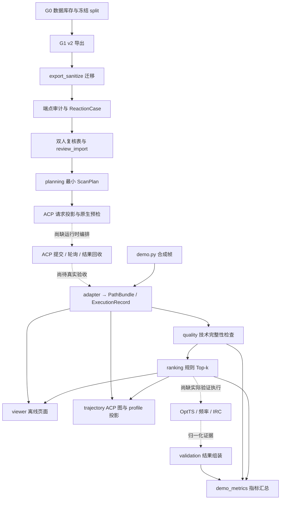

# PES2TS Demo 实现审核与架构解读

审核日期：2026-09-30。对象：当前工作区中本轮 Demo 相关实现、示例及数据产物。

> 路径注记（2026-10-03）：本文为 2026-09-30 时点审核，正文模块路径/行号按当时布局。其后 G-R 布局迁移已完成：`ranking.py` → `pes2ts_core/ranking/`，`scan_strategy/` → `pes2ts_core/generation/planning/`，`g2/` → `pes2ts_core/generation/execution/xtb_path/`；历史引用保留，不改写。

## 1. 结论

**当前是具备可运行代码和测试的数据合同、ACP 格式适配、排序及展示 Demo。真实反应的 ACP 计算、路径回收和 OptTS/频率/IRC 闭环尚未完成。**

架构方向符合双项目定位：ranking 仅消费 PathBundle，ACP 依赖集中在 integration，评估标签与生产合同分开。新增代码并非只有设计文档；合同、复核导入、计划构造、请求转换、结果归一化、质量检查、排序、查看器和指标统计均已有实现。

但 S0 严格合同和跨阶段来源关联仍存在缺口。本次补充反例复现了 6 项问题，其中前 4 项应在真实 QC 试跑或科学结果验收前修复。现有测试通过不代表这些反例已被覆盖。

### 实测与证据范围

- Demo 相关 10 个测试文件：**75 passed**。
- G1 v2、truth guard、文件工具回归：**38 passed**。
- 总计本轮成功执行 **113 项测试**。完整测试集未跑通：当前 Python 环境缺少 drfp，收集 test_neardup.py 时失败。初次沙箱测试还遇到临时目录权限问题；正常权限下的上述测试已通过。
- 使用当前本地 ACP checkout 重新生成请求，原生 V1JobCreateRequest、输入与扫描协议校验通过；没有提交计算任务。
- 使用真实 ACP TrajectoryFrame/Annotation 生成图，并通过 EnergyGraphResponse 校验：6 节点、5 标注（本轮只传入最高能规则 proposal）；6 个节点的 geometry_ref 全部为空。
- 重新运行端点只读审计：24 条、16 train + 8 valid、13 类一致性检查全部通过、0 条问题记录；24 条仍为 needs_review。
- 读回并校验三个示例目录中的 19 份合同文件：8 + 2 + 9 份通过当前合同加载器。该结果只代表现有验证规则下通过。
- 全库导出迁移清单记录 183,460 份导出，移除了同等数量的 endpoint_match 与 orientation，保留旧树。本次未重新遍历并计算全部约 1 GB 导出的摘要；上述数量来自现存迁移清单。
- 本轮没有运行 ORCA/xTB、没有提交 ACP 作业、没有判定人工化学复核结论，也未通过浏览器交互测试离线页面。

复现材料位于 `outputs/review_20260930/`：reproduce_findings.py、reproduction_results.json、source_sha256.json，以及本轮生成的 ACP 请求、图与 profile。所有反例均为合成输入，不涉及参考 TS/IRC 真值。

## 2. 六项可复现问题

P1：真实运行或可信结果统计前优先修复。P2：合同冻结及后续规模化前修复。

### F1 · P1：旧验证记录可被算作新 Top-1 候选的成功

位置：`pes2ts_core/demo_metrics.py:227`；相关位置 `ranking.py:45`、`integration/validation.py:198` 附近的结果构造。

**复现：**先为 probe-frame-8 构造通过的 ValidationResult，再改变路径能量，使同一规则的 Top-1 变成 probe-frame-0，重新生成 proposal。proposal ID 仍为 path ID + rule。把新路径、新 proposal 和旧 validation 交给 evaluate_demo_runs，仍得到 passed_cases=1。

**原因：**ValidationResult 没有冻结源路径/proposal 内容摘要；统计入口只比较 ID 和状态，没有核对验证所用 source_frame_id、源几何摘要与当前候选。build_validation_result 在创建时的旧 proposal 检查不能保护后来直接读入的历史验证记录。

**影响：**重排、补算或覆盖路径后，旧成功可能被错误归给新选择，端到端统计失真。

**修复：**ValidationResult 固定 path_content_sha256、proposal_content_sha256、source_frame_id、source_geometry_sha256；统计入口重新验证绑定。每个频率/IRC 阶段还应绑定同一 OptTS 输出结构及协议，避免不同任务的状态被拼接成成功。Top-k 改为逐 seed 验证记录，显式聚合。

### F2 · P1：只核对目标坐标，就把实际不合格结构标为 usable

位置：`pes2ts_core/integration/acp/quality.py:82` 和 `:119`。

**复现：**让 9 帧拥有正确的 target_coordinate、有限能量和 converged=True，但 actual_coordinate=99 Å、约束残差=99、所有原子坐标重合。assess_scan_path_quality 的所有 checks 都为 True，apply 后 status=usable，ranker 输出 accepted。

**原因：**局部变量 actual 实际取的是 target_coordinate；实际坐标、constraint_residuals 和几何均未参加通过判断。检查的是采样目标记录是否完整。

**影响：**约束没有满足甚至碰撞结构，也能进入正式候选队列。这里的问题早于是否找到正确 TS，属于扫描路径自身的有效性问题。

**修复：**从几何重算驱动距离并核对 actual/target，验证约束残差；加入碰撞、帧间连续性和必要拓扑检查。若只保留完整性检查，应另设 execution_complete/technically_complete，不能直接赋予 ranking 所依赖的 usable。

### F3 · P1：ACP 方法参数在请求和回收两端丢失

位置：`pes2ts_core/integration/acp/adapter.py:218`、`:230` 和 `:290`。

**复现 A：**冻结 ORCA/B3LYP/def2-TZVP/water 的 ScanPlan，请求中的 scan_optimizer 只留下 method=B3LYP，method_levels 同样缺失基组和溶剂。

**复现 B：**回收帧明确含 optimizer_level={method:HF,basis:STO-3G}、optimizer_engine=orca；转换后扫描能 method_id 却回填为计划中的 B3LYP。

**影响：**实际执行的计算设置可能偏离冻结计划；不同方法的能量可能被错误标记为可比。当前默认 GFN2-xTB 合成样例未触发这类差异，但通用 method 参数入口已经接受这些输入。

**修复：**完整投影已支持的 MethodSpec 字段；未支持的非空字段必须拒绝。回收时优先使用 ACP 实际 optimizer_level/engine/版本和参数摘要；缺失则保留未知，不拿计划方法冒充实测方法。执行前后都比较 requested/effective 方法签名。

### F4 · P1：PathBundle 合同未保护原子身份和三维数值几何

位置：`pes2ts_core/contracts.py:281`。

**复现：**将某帧 atom_map_ids 顺序反转，当前 dumps_document 仍通过；将该帧 geometry 改成三个 ['not-a-number'] 单元素数组，重新封存后也通过。

**原因：**目前主要比较数组长度，没有比较每帧与顶层映射的顺序，没有要求每个坐标为 3 个有限实数。_finite_tree 只能发现非有限浮点数，不能发现字符串坐标。类似地，能量通道对 value 的类型检查也不完整。

**影响：**ranking 直接接受独立 PathBundle 时缺少保护；原子错位会损害下游几何身份，畸形坐标可能延迟到绘图或计算提交时才报错。查看器较严格的额外检查不能替代共享合同。

**修复：**统一校验 n_atoms、非空唯一 map、逐帧 map 顺序、元素一致性、N×3 有限数值、frame_id、能量值与方法引用；为每层嵌套对象提供结构规则，错误统一为 ContractError。

### F5 · P2：输入几何改变后仍可能复用相同计划和请求 ID

位置：`pes2ts_core/planning.py:119`。

**复现：**保持 case_id，移动不参与 H–N 驱动距离的碳原子，重新封存 ReactionCase。source_case_sha256 已改变，但 plan_id 和 request_id 与旧计划完全相同。

**原因：**plan ID 摘要输入包含 case_id 与候选配置，没有纳入 source_case_sha256；而复核转换等流程允许同 case_id 对应不同内容快照。proposal ID 同样未包含 path 内容摘要与 top_k。

**影响：**将这些 ID 用于 ACP 幂等提交、缓存或产物名时，不同输入可能碰撞；当前尚未提交任务，因此这是必须在运行时适配前修好的问题。

**修复：**计划 ID 纳入源 case 摘要和策略版本；proposal ID 纳入路径摘要、ranker 版本、规则和 top_k。实验归属与计算复用分别记录，重试创建独立 attempt ID。

### F6 · P2：ArtifactRef 的 Windows 父目录引用未被拒绝

位置：`pes2ts_core/contracts.py:505`。

**复现：**relative_path 为 `..\outside.xyz` 时 validate_artifact_ref 返回空问题列表。

**原因：**只用 PurePosixPath 识别路径，没有先处理反斜杠或 Windows 路径语义。

**影响：**该合同工具未兑现包相对路径不能越界的承诺。当前 ACP manifest 消费端另有 resolve+relative_to 检查，本次没有发现该具体消费端因此越界；风险在复用此公共合同的其他消费者。

**修复：**统一路径规范化，拒绝两种分隔符下的父目录、根路径、盘符、UNC；读取前再解析最终路径并检查位于包根内。

## 3. 当前整体架构

contracts.py 是这些对象的共同依赖。图中实线主要代表已经实现的数据函数；连接 ACP 运行与 QC 验证的虚线表示运行时缺口。合成样例直接提供帧与执行记录，不经过真实扫描。

## 4. 各部分功能与实现解读

### 4.1 G0/G1：提供身份和端点基础

原有 G0 负责数据下载、库存、split、去重及真值隔离；原有 G1 负责映射、互斥成断键编辑和反应分类。它们继续作为两个新项目的共同数据基础。

这轮修改了 v2_gate.py 的导出，去掉 IRC endpoint_match/orientation；v2_verify.py 增加禁用字段检查。export_sanitize.py 负责旧树的非破坏迁移：白名单检查、移除禁用字段、逐文件写 staging、生成来源/目标摘要清单，再发布新树。

已有迁移工具与报告，但“清除了字段”不等于“消除了参考信息对映射和群体筛选的影响”。truth_assisted_p1 来源必须继续保留，正式泛化评价仍需要相应限定或端点独立对照。

### 4.2 端点审计、自旋与人工复核

`scripts/audit_demo24_endpoints.py` 对候选 ID、官方 split、映射 SMILES、元素、成断键、组分、电荷、坐标等做一致性检查。它不判断反应是否为合理单步基元过程。

`g1/reaction_case.py` 把导出转换为标准 ReactionCase。自旋由组分来源推导：全为单重态时可确定；只有一个非单重态组分时取该组分多重度；多个非单重态组分或缺失来源保持未知，不把 multiplicity_max 当体系自旋。

`scripts/build_demo24_reaction_cases.py` 生成 24 份 needs_review 案例和清单。`g1/review_import.py` 用标准库读取 XLSX 的三个复核页，拒绝公式、空决策、重复反应、身份不一致及不完整复核；`scripts/import_demo24_review_workbook.py` 核对冻结案例摘要并写新快照。

**边界：**目前 accepted 复核要求两人均认为 1D 可行。这适合 M1 的最小计划，无法直接表达“化学上接受，但需要 synchronized/PATH/NEB”的 D–H 类反应。扩到 Demo24 前应把化学接受和扫描方法资格分开。人工修正来源自旋时也应新增复核证据，不能继续强制等同自动来源推断。

### 4.3 contracts.py：共同语言与完整性

实现七种核心对象和 ReviewRecord；统一 schema 名称、版本、状态、创建时间、producer、input_refs 及 content_sha256；提供创建、封存、JSON 读写和验证函数。当前是手写 Python 验证器，尚无独立 JSON Schema 文件。

已有优点：顶层字段白名单、非有限浮点拒绝、状态隔离、扫描与精化能量通道分开、成本缺失为 null、重复帧 ID 和部分来源关联检查。

待补：嵌套校验（F4）、ArtifactRef（F6）、MethodSpec 注册与完整指纹、输入引用的递归核验、UTC 强制检查、producer 的提交/dirty 版本信息。当前 producer 固定 name/version，且不在科学摘要中，尚不足以独立复现算法环境。PathBundle 也未自带 dataset_version/split，独立评价需显式关联冻结 cohort。

### 4.4 planning.py：最小 G1 计划构造器

接收 ready ReactionCase；优先选择 H 转移的成键距离，否则只允许单根 formed/broken 驱动；成键从产物侧、断键从反应物侧出发；用两端点测得距离线性生成 3–101 个点。其余编辑可保留为观察键。

冻结了方法、重试设置、预算、候选 ID 和 source_case_sha256；不支持的策略可输出 rejected ScanPlan，让分母保留拒绝案例。

**边界：**当前只有一个候选、一个均匀距离坐标；没有完整双向锚点比较、装配搜索、多键同步、有限回退树或 PATH/NEB 执行。plan_id 来源问题见 F5。端点距离上限检查不等于化学计划已可靠。

### 4.5 integration/acp/adapter.py：格式边界

分三组函数：

1. ScanPlan → ACP PesScanRequest / V1 job-create body：核对 case 摘要、身份、原子索引、均匀坐标和引擎；CLI 可调用实际 ACP 模型静态校验。
2. ACP 归一化记录 → ExecutionRecord / PathBundle：绑定候选和任务、保留失败尝试与成本、拆分能量通道；几何加载器由调用方注入，以保留 ACP 的远程路径解析职责。
3. ACP 产品清单构造与消费端摘要验证：约束 RESULT 相对路径，核对文件存在、SHA256 和可选大小。

**边界：**新增的 `ACPCLIBackend` 直接运行本地 `python -m acp.cli run PESsearch`，绕过 ACP scheduler 的 submit/poll/task registry；纯 CLI 模式没有 `acp_task_id`。它为每个不可变 attempt 保存请求、日志、退出码、进程状态和结果清单摘要，可超时/取消并在进程中断后恢复已完成的 RESULT；失败重试需要新的 attempt ID。ACP CLI 返回成功后还要校验 v2 manifest、注册产品和 PES profile，并可从 WORK XYZ 回收帧。wall-time 有硬超时；CPU 时间仍未知，nproc/memory 只是交给 ACP 的资源配置。真实 ACP/QC 尚未运行，因此目前只在隔离假 CLI 上证明进程闭环。

### 4.6 quality.py：技术完整性检查

把 ScanPlan、ExecutionRecord、PathBundle 身份对齐，检查执行是否完成、帧数是否等于计划、目标点顺序、收敛标志、扫描能量是否齐全和同方法。返回报告并可封存带新状态的 PathBundle。

这已经区分任务完成、数据不完整和路径不可用，但目前缺少实际坐标和化学有效性，见 F2。apply 仍复用 path object_id；后续应记录质量判断版本与输出快照关系。

### 4.7 ranking.py：独立的两条规则基线

- highest_scan_energy：把有扫描能量的真实帧按能量降序排列，包含端点。
- internal_scan_peak：只保留有左右邻点且能量不低于两侧的内部局部峰，再按能量排序。
- unusable 路径拒绝；needs_review/unchecked 可以生成待审建议；只有 usable 才可 accepted。
- 输出 rank、frame_id、绝对能量 score、规则理由、几何摘要和源路径摘要。

模块不读取 G1 私有文件或 ACP 数据库，也不运行计算，符合独立项目定位。当前没有键进度、连续性、跨路径排序或学习模型；score 是能量，不是成功概率。内部峰对平台区使用 >=，可能给出多个相邻平台候选，后续需去冗余与更明确拒绝理由。

### 4.8 viewer.py 与 trajectory.py：两个展示出口

**离线 viewer：**生成不依赖外部库的 HTML，内嵌 PathBundle 和两条规则的结果。Canvas 绘制能量曲线和可旋转结构，点击帧联动；缺失能量断线；结构连线仅用距离阈值估计。页面明确提示未做 TS 验证。

**ACP trajectory：**从指定 checkout 加载真实 TrajectoryFrame/Annotation，检查导入来源并记录 frames.py 摘要；生成原生图字段和可供 PESsearch builder 读取的 pes_profile_v2；独立展示扫描、精化、相对能通道；核对 proposal 路径与几何摘要。

**边界：**离线页面不等同 ACP Workbench 集成；ACP 图中的 geometries 是额外交接表，HTTP 查看器仍需正式 RESULT 几何及解析器。本轮 6 帧均无 geometry_ref，因此图模型通过也不足以证明实际 Workbench 可加载结构。当前没有经过真实任务路由、远程缓存和浏览器端到端验收。

### 4.9 integration/validation.py 与 stage_results.py：物理证据组装和回收

接收已经归一化的四个阶段证据字典；验证 usable 路径、accepted proposal、源路径摘要和 Top-1 几何；根据状态推导 not_run/incomplete/failed/passed。passed 需要 OptTS 收敛、first_order_saddle=True、一个虚频、IRC 两端分别标记为 R/P；同时记录阶段尝试和成本。

`integration/acp/stage_results.py` 新增只读 ACP v2 产物收集器：对 BatchOptimize 校验 TS 结构和 normal_modes 产品关联、模式自由度数量、有限振动频率、虚频标志和原子位移维度；由实际 `batch_provenance.json` 生成方法与协议摘要；把实际 `input.xyz` 与 proposal 源几何对比。对 IRC 校验双向 endpoint Product、report 路径与 RESULT 文件一致、TS provenance 的 XYZ 文件摘要和方法/基组；使用固定原子顺序的 proper-rotation Kabsch RMSD 将端点匹配到 ReactionCase R/P，默认阈值 0.35 Å。

**边界：**`acp-validate-run` 已串行启动 BatchOptimize 与双向 IRC，使用独立 attempt 目录、请求哈希、日志、结果清单校验和墙钟超时；只有首阶段产物通过方法、频率和几何检查后才会启动 IRC，并将优化 TS 文件哈希写入 ACP 要求的 provenance。`acp-collect-validation` 仍可独立回放已有产物。执行器目前由 fake ACP CLI 和合成 ACP v2 目录验证，未实跑 QC，也不解析调度器状态或原始 ORCA 日志。自旋和频率振型沿反应坐标的科学解释仍需单独复核。当前只接受 proposal 的首个候选，未实现 Top-3 的逐帧验证与预算分配。

### 4.10 demo_metrics.py：评价统计框架

以冻结 cohort 的 reaction/case 为分母，保留没有运行记录的反应；验证 plan/execution/path/proposal 关联；按 split 汇总计划覆盖、完成率、usable 覆盖、验证通过率、失败原因和成本完整性。ranking 标签单独输入，没有标签时返回 not_measured；总成本不完整时给已知下界。

**边界：**每个 case 只能一个 execution/path/validation；目前还没有“多候选先聚合”的实现，因此不能声称已完整支持全部回退及跨路径比较。标签要求 acceptable_frame_ids 非空，不能表示“已完整验证但无任何可用帧”的负例；后续需区分未标注、正例、负例，才能评价拒绝策略。尚无同帧验证跨规则去重、严格同预算 QC 对照或实际 Demo24 指标。F1 必须先修复。

### 4.11 CLI 与工程组织

`bin/pes2ts` 为 demo/view-path/project-acp/acp-request/acp-run/acp-collect-validation/acp-validate-run 提供轻量入口，避免这些命令导入 DRFP；G0 指纹改为使用时加载 DRFP。ACP 运行命令复用 `pes2ts_core.cli` 参数解析；其他 ACP 投影命令仍在 bin 层解析，后续可统一成按子命令惰性加载。

当前 contracts.py、planning.py、ranking.py、viewer.py 都是单文件原型，足够支撑当前规模。是否拆成包应跟随实际职责与测试需求；优先修复边界一致性。许多新增源码仍未纳入 Git 提交，本次不能仅凭 HEAD 重建这个 Demo；应在修复和验收后形成可追溯提交。

## 5. 对照统一阶段的验收状态

| 阶段 | 本次判断 | 依据与剩余项 |
| --- | --- | --- |
| S0 合同及映射 | 合成/预检层基本成立，真实结果需继续验收 | 可执行合同、ACP 原生预检和清单产物校验已存在；真实端到端 ACP 数据仍待跑通 |
| S1 数据隔离及样本 | 工程准备已落地，化学复核未完成 | 已有清理导出、审计、24 案例、复核表和导入器；24 条均 needs_review |
| S2 最小计划 | 原型已实现，真实放行待复核 | 单距离/H 转移及真实输入预检示例；完整 G1 候选树未实现 |
| S3 ACP/G2 | 本地 CLI 进程闭环通过合成回归；真实计算未验收 | 单 attempt 调用、超时/取消、恢复、清单校验及 WORK 几何回收已实现；仍无真实 QC 输出证据 |
| S4 ranking/展示 | 合成数据上成立，真实路径验收未完成 | 两条规则、离线 HTML、原生图投影已实现 |
| S5 物理验证 | 执行与结果组装命令已贯通；真实科学验收未完成 | `acp-validate-run` 串行运行 BatchOptimize→双向 IRC，`acp-collect-validation` 可离线回放；真实 OptTS/Freq/IRC 未提交 |
| S6 复杂路径 | 待开发 | 多键、H2、芳香/键级、PATH/NEB 未形成执行链 |
| S7 24 条 Demo | 统计框架与 train-first 执行器已准备，实验未开始 | 有冻结清单运行入口、逐案路径包/提案和 cohort 指标；无真实运行包与标签；人工复核待完成 |
| S8 规模化/模型 | 未开展 | 当前没有支撑模型训练或成功率结论的实测结果 |

不能把 S4/S5/S7 的函数存在理解为按顺序完成了这些阶段；目前是提前开发了这些阶段的接口框架。

## 6. 建议的后续工作顺序

1. **先封住结果可信性缺口：**修复 F1–F4，并把本次反例转换为回归测试；共享合同统一规范。
2. **稳定身份和路径规则：**修复 F5/F6，冻结 MethodSpec、源摘要、阶段输出摘要与不可变快照规则。
3. **完成真实样本复核：**按已建立流程导入人工结论；把化学接受与 1D 执行资格分开。重新从 accepted 快照生成计划，旧预检示例不可直接当正式放行依据。
4. **跑通一条真实 train A/B 反应：**提交、查询、回收、实际方法核对、几何质量判定、产品发布与预算记录全程可追溯。
5. **补齐 ACP 真正显示链：**本轮已补 RESULT XYZ 几何物化与 ACP v2 清单登记，并让 PathBundle 引用登记后的结构；ACP 任务路由、远程缓存和浏览器点击联动仍需 ACP 任务导入/注册后实测，离线查看器继续作为可移植案例页。
6. **做一次真实 Top-1 物理验证：**频率和 IRC 绑定同一 OptTS 几何，以原始产物支撑结果；保留失败。
7. **再扩到复杂类型和 24 条：**补多候选聚合、Top-k 成本与验证去重、负例标签和同预算对照，随后冻结 valid 评价。

整体上，应继续使用当前架构推进。近期开发重心应从增加新功能转向“输入、实际执行、产物、候选和验证是否指向同一份科学内容”的一致性，完成后再接真实计算。

## 7. 修复回归检查（2026-09-30）

本节记录上述审核后代码与反例回归的更新，不改变“尚未完成真实 PES→TS 闭环”的总体结论。

| 原问题 | 当前实现与回归覆盖 |
| --- | --- |
| F1 验证结果可错配新候选 | ValidationResult 记录路径/提案摘要、初猜帧 ID 与几何摘要；通过统计重核当前 PathBundle、proposal、选中帧和几何。路径能量改变后重排的旧验证记录被拒绝。 |
| F2 不合格实际几何被接受 | 质量门从 N×3 几何重算扫描距离，比较目标距离、ACP actual coordinate 和 constraint residual；发现约束超差或小于 0.45 Å 的原子间距时判 `unusable`。该几何阈值仅排除明显重叠，不等于化学结构验证。 |
| F3 计算方法丢失/被计划值冒充 | 请求投影完整传递 ACP 支持的 method/basis/dispersion/solvent/grid/SCF/RI 字段；未映射非空字段拒绝。回收使用 ACP 帧的 `optimizer_level`/`optimizer_engine`；实际方法未知时记为 null，质量层不得认为能量可比。计划方法留在 provenance。 |
| F4 原子顺序及几何合同过松 | PathBundle 帧映射必须逐项等于顶层顺序，元素序列跨帧一致，几何必须为有限数值 N×3；ReactionCase 端点几何同样检查。 |
| F5 输入改变仍复用 ID | ScanPlan ID 纳入来源 ReactionCase 内容摘要；proposal ID 纳入 PathBundle 摘要、规则版本与 top-k。 |
| F6 Windows ArtifactRef 越界 | 统一处理反斜杠与正斜杠，拒绝 Windows drive/UNC 与 `..` 越界。 |

## 8. Train-first cohort runner（2026-09-30）

新增 `acp-demo-run` 和 `pes2ts_core/demo_runner.py`，把单条 ACP CLI 运行扩展为清单驱动的 train-first cohort。运行清单固定全部 ReactionCase 快照，并强制每条都提供且仅提供一个 runs 行；引用限定在清单目录内。默认 valid 只计入冻结分母并标记 `valid_held_out`；valid 正式运行需要同时提供同一清单和完整输入/配置/ACP Python 源码摘要匹配的 train-only 执行索引，并核对 cohort 与 valid held-out 记录，避免变更运行环境后沿用旧 train 结果。最终 valid bundle 复用并携带 train 产物，仅执行 valid cases。每个通过人工复核门的 train case 单独生成 ScanPlan、ACP attempt、ExecutionRecord、PathBundle、质量报告、两种排序提案和离线查看器；可选的 `budget` 写入 ScanPlan 身份，限制最多 5 次外层尝试，所有尝试共享冻结的 wall-time 上限并以新 attempt ID 运行。失败和成功 attempt 统一保留在 ExecutionRecord 及 CLI receipt 扩展中，未知 CPU 成本仍显式留空。ACP CLI 没有可用的 CPU 计数接口，因此 CPU 小时只留作声明预算，不能声称受到硬运行时限制。独立 ranking 标签作为独立文件载入、保留来源摘要并进入指标评估，不从路径推断标签。最后写入 `DemoRunBundle.json`、`DemoMetrics.json` 与 `DemoExecutionIndex.json`。输出根目录要求为空以避免覆盖既有运行包。

另新增 `scripts/build_demo24_execution_bundle.py`，把复核导入器生成的 24 条快照/ReviewRecord 对账并复制为运行输入包，核对原始反应身份、16/8 split、复核摘要和每个 reviewed case 回溯的 endpoint-case 摘要；拒绝覆盖既有包并写出输入冻结摘要。该工具只消费完成的人工复核导入结果，不接受空白工作簿，也不替人作出决定。synthetic-only 24-case fixture 验证通过，不能作为真实化学复核证据。

验证：fake ACP cohort 成功执行测试通过，train 生成完整路径与两种提案，valid 保留在 cohort bundle 与指标中的显式 held-out 行，运行记录覆盖率仍为完整 cohort；独立标注计入排名分母且不因缺路径而伪记 miss。valid 评价复用 train 的执行记录和路径，仅提交 valid case；调用计数测试确认未重复提交 train。train 索引同时绑定清单、case/review 内容、标签、资源配置和 ACP Python 源码摘要；改动标签后会拒绝沿用旧 train 索引。ACP 非零退出测试通过，失败 ExecutionRecord 和未知 CPU 成本进入 bundle/metrics；失败后重试测试确认 attempt ID 不同、记录顺序为 failed→completed，失败日志与哈希摘要仍可追溯。另验证 retry budget 会改变冻结 ScanPlan ID。Metrics 新增基于实际 ACP receipt 的 wall-time 汇总，缺失/非法 receipt 只计入已知下界、不使用计划预算冒充实际耗时。pytest 用项目内临时目录替代受限默认 tmpdir 后，ACP/合同/验证及 Demo 相关定向回归 **80 passed**；两个 CLI 的 `--help`、语法编译和 `git diff --check` 通过。测试均使用 fake ACP/合成数据，没有运行真实 ACP/QC。`acp-demo-run` 仅补齐 S7 的工程准备，不代表 24 条 Demo 已运行或可报告成功率；24 条仍须先完成人工复核，再从 accepted 快照构造冻结运行清单。

补充回归：以相同的受限临时目录兼容方式运行更广的本地套件（排除需缺失依赖的 `test_neardup.py`，并排除标记为 `realdata` 的用例），结果为 **447 passed、20 failed、2 deselected**。20 个失败均来自当前 Python 环境缺少 `drfp`，集中在既有 G0 pipeline/split-freeze 测试的 `ModuleNotFoundError`；本次新增的 ACP、合同、Demo runner、验证和 execution-bundle 用例通过。该结果说明本轮改动的相关回归通过，但全仓套件仍未全绿，不能把环境依赖缺失记作通过。

复核门复查：当前包内的 [Demo24 双人化学复核工作簿](</E:/Calculations/AI4S_ML_Studys/PES2TS/outputs/01a0ed78-73eb-7833-b3c1-4a6c0733a397/Demo24_双人化学复核.xlsx>) 是空白模板。24 条记录在两位审阅页均保留 `pending` / `not_reviewed`，裁决页也均为 `pending`；源复核队列的 16 train / 8 valid 状态一致。因此，没有任何样本可被视为人工接受，也没有可安全启动真实 ACP/QC 的 train 案例。

## 9. ACP CLI 帧几何发布（2026-09-30）

CLI backend 在 ACP 正常完成并通过原始 v2 结果检查后，会从 `WORK` 的各帧 XYZ 重新解析 N×3 坐标及元素顺序，将同一几何写入 `RESULT/pes2ts/frames/frame_<index>.xyz`，并向 ACP `result_manifest.json` 追加带帧序号、SHA256 和文件大小的 `file` 产品。`collect_cli_path_bundle` 只接受与 profile 帧索引一一匹配的已登记几何产品，PathBundle 的 `geometry_ref` 因而指向 `RESULT`；恢复运行会校验/补齐这一物化步骤并更新 receipt 中的 manifest 摘要，不会重复提交计算。原生 ACP profile 和 `WORK` 几何不被改写。

验证：fake ACP CLI、manifest integrity、路径质量、阶段执行、TrajectoryFrame、合同、valid/train cohort、指标、冻结运行包与验证链相关回归 **87 passed**。覆盖了全部扫描帧的 RESULT 结构文件、产品哈希与帧引用、receipt 与最终 manifest 摘要一致、中断后复用 attempt，以及即使攻击者同步改写产品摘要也会因 RESULT 几何与 WORK 原帧不一致而拒绝回收。另用 ACP 项目的真实 `TrajectoryFrame` 源码投影了 6 个合成帧，均带已登记 RESULT 几何引用，`geometry_refs_missing=0`（合同源码 SHA256 `5e1cf4fae47b97449c2ed958a0f6c19b83f02483cc1e180e833149f35969ec4c`）。尚未把 CLI 结果登记到 ACP scheduler，因此这些结果仍不能单独证明 Workbench API 路由、远程结构缓存和浏览器联动已实测；完整 ACP UI 验收仍待任务导入/注册能力。
