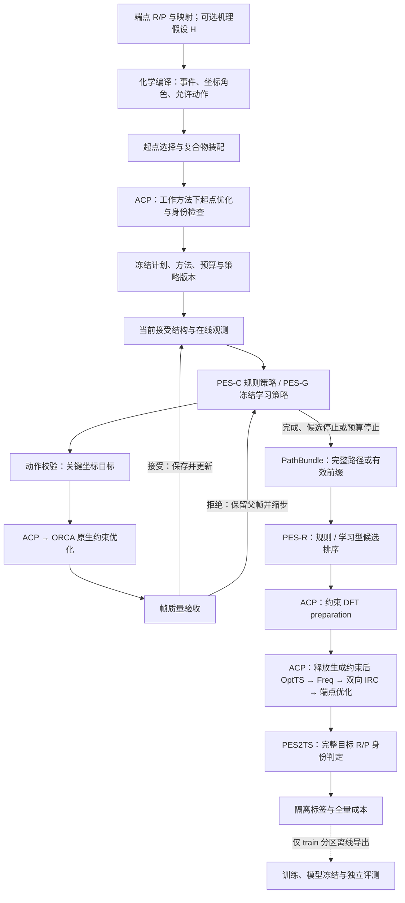

# PES-C 与 PES-G 共同架构及迁移方案

> 最新承接（2026-10-05）：[PES-N 未来计划](../plans/PES2TS_PES-N未来开发计划_v2_20261005.md)及 [ADR-0010](decisions/ADR-0010-PES-N反应状态价值与STOP-MOVE统一决策.md)已成为当前开发方向。本文控制器/原生优化分工与冻结基线、单帧→四例→24例验收保留；独立 PES-R 学习及后续学习顺序由新计划取代。以下提案状态指本文原始记录，不宣告生产迁移完成。

> 状态：设计提案（已汇总本轮用户选择；尚未实施、未改变生产默认或能力状态）
> 层级：G2 Classic 生成与执行改造；衔接 G3 PES-R、G4 学习型生成；工作流 R / X
> 取代关系：不取代当前 G2.T 战役、既有结果或阶段定义；拟替换未来主链的数值校正实现
> 上游依赖：[开发宪法](../PES2TS_开发宪法_v1.md)、[阶段定义](../plans/PES2TS_阶段定义_G0-G3.md)、[完整开发流](../plans/PES2TS_完整开发流方案_整合版_v1.md)、[Classic→Rank→Gen](../plans/PES2TS_G2后续开发方案_Classic到Rank到Gen_20261003.md)、[ADR-0002](decisions/ADR-0002-计算后端统一经ACP执行.md)
> 下游消费者：PES2TS 规划/生成/质量/排序/验证模块，ACP 约束优化能力开发与联合验收
> 当前版本：v1 @ 2026-10-04
> 决策记录：[ADR-0006（Proposed）](decisions/ADR-0006-ORCA原生约束优化与控制策略分离.md)
> 整体修改提案（2026-10-05）：[G0–G4 开发框架](../plans/PES2TS_G0-G4整体开发框架修改方案_v1_20261005.md)承接本文控制/原生优化分工，更新后续共享模型与阶段组织建议；原基线与迁移证据保留。

> 后续发展提案（2026-10-04）：[统一价值模型与搜索排序一体化](../plans/PES2TS_统一价值模型与搜索排序一体化发展方案_v1_20261004.md)及[ADR-0007](decisions/ADR-0007-统一价值模型与搜索内生选点.md)拟调整本文 G/R 独立学习与内部后排序假设；控制器/ORCA 分工仍保留。该提案尚未使现行规范、生产默认或本文历史设计生效状态改变。

本文给出完整目标架构和分阶段迁移建议。规范约束以开发宪法为准；本文中的接口名称、字段、参数与任务属于提案，在正式版本化登记及实现前不视为已生效合同。本文没有启动计算或修改业务代码。

## 1. 核心决策与术语

**PES2TS 决定关键反应坐标如何推进；ACP 执行任务；ORCA 完整承担几何优化；PES2TS 判断路径与目标反应是否成立。**

- **PES-C**：本讨论对 Classic 基线的简称，属于既有 PES-G generation 轨道的 L-G0/L-G1；不是新增工程阶段或独立产品轨道。
- **PES-G**：沿用仓库中的 generation 轨道名称。本文说“升级为 PES-G 学习控制器”，指用冻结的学习策略替换规则策略，而不是重新建立一套计算引擎。
- **PES-R**：候选排序轨道；它决定哪些生成帧值得精修，与生成控制器分开。
- **关键坐标位移**：对少量内坐标指定目标增量，例如键长、键角、二面角。完整原子结构仍交给 ORCA；未约束自由度可以松弛。
- **ORCA 原生优化器**与 `Native-GFN2-xTB` 是两个不同概念：本次改造使用 ORCA 的几何优化器，初期保持既有 `GFN2-xTB` 方法；不同时切换哈密顿量实现。

开发顺序沿用 **G2 Classic 闭环 → G3 固定生成下的 PES-R → G4 自适应/Oracle/学习生成**。模型可提前设计接口，但不以本提案宣布 G3/G4 已启动或已通过。

## 2. 当前实现与目标实现

### 2.1 本轮核查到的现有事实

| 对象 | 当前情况 | 目标改造 |
|---|---|---|
| `planning/connectivity_plan.py` | 完全成键/断键作为距离 driver；统一 λ；默认线性目标；有 `phase_profile` 能力 | 先保持相同计划，再逐步增加不同进度与角色选择 |
| `planning/continuation.py` | 预测→corrector→验收；只有接受帧更新状态；拒绝缩步 | 保留外层事务与策略，替换 corrector 实现 |
| `planning/local_corrector.py` | 自研投影 BFGS、局部保护、锚定与释放 | 从拟议主链退出数值优化；保护语义单独处理 |
| `integration/acp/gradient_backend.py` | ACP `OrcaGradient`；ORCA 输入为 `SP EnGrad`；约束留在 PES2TS | 新增 ACP 原生约束优化适配器，返回统一帧结果 |
| `generation/campaign.py` | 专用 connectivity plan 与 `make_corrector` 直接接线 | 渐进适配通用执行记录，不宣称今天已全量接入 `GenerationPlanV2` |
| 原生约束能力 | 仓库有编译/适配基础和能力探测产物 | 单帧生产合同、预算、取消、证据完整性仍需联合验收 |
| 严格接受证据 | 外层 `require_physical_gradient` 默认 false | 新实验明确冻结帧资格，不能给历史接受帧补盖“物理驻点”标签 |
| xTB→DFT preparation | 本轮未证实存在完整接线与真实闭环 | 在候选精修入口显式建设并验收 |

源码入口：[计划](../../pes2ts_core/generation/planning/connectivity_plan.py)、[延续](../../pes2ts_core/generation/planning/continuation.py)、[校正](../../pes2ts_core/generation/planning/local_corrector.py)、[梯度适配](../../pes2ts_core/integration/acp/gradient_backend.py)、[战役](../../pes2ts_core/generation/campaign.py)。

既有 [ORCA 约束能力探测记录](../../outputs/acp_synchronized_capability_20261002/receipts.json)包含混合距离/角度/二面角与五个同时距离约束的成功实验。这证明所测试的基础能力，不能替代当前四例、24 例或严格目标 TS 的验收。本文不重新判定正在进行的战役状态。

### 2.2 保留、替换与新增

| 处理 | 内容 |
|---|---|
| 保留 | 端点身份/映射、图编辑、起点准备、外层接受/拒绝、候选记录、ACP 传输纪律、真值隔离、成本与恢复 |
| 替换 | 主链中的 BFGS 更新、线搜索、能量驱动坐标迭代、约束重投影优化，由 ORCA 承担 |
| 新增 | 规则/学习策略共同接口、原生约束优化请求/结果、明确帧资格、DFT preparation、模型特征与分裂版本 |
| 留作对照 | 旧投影 BFGS、RMSD-PP 等有独立方法身份的基线；不作为静默生产回退 |

## 3. 完整系统架构



生成在线闭环使用当前导航计算结果；严格验证结果进入隔离标签流程，不用于当前推理或 valid/test 调参。机理先验可由 RPH-Agent 提供，文献推理不进入 PES2TS 执行层。

### 3.1 单一职责

| 层 | 负责 | 接口输出 |
|---|---|---|
| 输入与化学编译 | 端点/映射核验、H、事件、允许动作与目标身份 | 化学计划与 provenance |
| 生成策略 | 方向、候选调度、关键坐标增量、继续/停止建议 | ActionProposal |
| 动作与帧验收 | 化学可行域、结构连续性、约束误差、证据资格 | accepted/rejected + 原因 |
| ACP | 任务、进程、资源、缓存、取消、QC 调用及原始证据 | FrameOptimizationResult |
| ORCA | 几何优化器、能量/梯度计算与内部优化迭代 | 优化结构、收敛信息、轨迹 |
| PES-R | 在固定候选池中排序，预测精修价值/成本 | SeedProposal |
| 验证与评测 | 物理证据解释、目标身份、标签/指标/分裂 | ValidationResult、评测报告 |

ACP 不重复实现化学路径选择；PES2TS 不建立第二套进程/HPC 调度系统。权限与执行边界引用宪法 R3/P4。

## 4. 输入、事件和关键坐标

### 4.1 输入与适用范围

首版消费已放行的 R/P 结构、原子映射、电荷/自旋、完全成键/断键活动视图及方法来源。保留映射来源、队列选择、开发暴露记录；现有辅助资产不自动成为独立泛化队列。

H 的事件、先后关系、必要立体约束可逐步扩展，接口沿用宪法 §5。当前完全 F/B 范围内实施；键级变化、芳香重排、仅构象变化及角/二面角主驱动是后续单独登记能力，不在后端替换时顺带开放。

R/P 可知不代表参考 TS 可知。控制器输入不包含参考 TS/IRC、由它们导出的动作或距离特征，依据宪法 R1。

### 4.2 坐标角色沿用四角色

| 角色 | 含义与建议行为 |
|---|---|
| `driver` | 本步主动推进的反应坐标；编译为显式目标约束 |
| `monitor` | 自然变化的观察量；默认不加硬约束 |
| `guard` | 经计划说明的局部保护条件；区分 ORCA 可表达约束与优化后接受检查 |
| `target_test` | 终点及目标反应判定量；不是每一帧都固定到终点 |

“辅助坐标”只是使用目的，不新增第五种角色：有必要固定的角/二面角登记为 guard 或 driver；仅观察的登记为 monitor。每项注明原子映射、单位、启用区间、允许范围和来源。

首轮保持旧 F/B driver 集合用于公平对照。随后研究少量主驱动 + 其余监测。未经版本化实验，不自动把所有非驱动原子或所有保留键固定。

### 4.3 关键坐标示例

SN2 主要使用 `d(Nu,C)` 与 `d(C,LG)`；进攻角按需求作为辅助条件。质子转移主要使用供体—H 与受体—H 两个距离。成环可使用少量闭环距离与必要方向信息。

以上是设计模板，不是每类反应唯一正确坐标。坐标过少可能遗漏必要运动；过多可能造成不相容约束或人为路径。初猜的构象和片段接近方向独立留档。

## 5. PES-C 控制与 ORCA 数值优化

### 5.1 规则策略

PES-C 从冻结计划产生关键目标。最初保留统一进度：

\[
q_i(\lambda)=q_i^0+f_i(\lambda)(q_i^1-q_i^0).
\]

对照曲线包括线性、平滑曲线及有限的成键先行/断键先行/协同方案。每个 driver 可有自己的 `f_i`，避免默认把所有键变化强制为同一百分比。不同曲线是待验证假说，不直接等于真实机理。

步长同时受 Δλ 和每坐标实际增量限制。距离、角度、二面角分别配置单位与上限。距离 0.02–0.05 Å 仅作为开发校准候选区间，未作为通用最优值。成功且连续时增步，拒绝时缩步；规则版本、参数与随机种子冻结。

### 5.2 初始结构

首版每步直接使用上一接受帧，提交新的目标约束。ORCA 负责原子实际位移和松弛。必要时增加可回放的轻量几何预测，只准备初猜，不引入另一套能量优化循环。

同一步的所有 driver 目标一起提交，避免把多个单坐标 scan 组合成笛卡尔积网格。多次优化对应外层选择的动作，而不是隐藏展开的搜索空间。

### 5.3 ORCA 执行的优化问题

\[
X_{t+1}\approx\operatorname{LocalOpt}_{X}\ E_{QM}(X),
\qquad q_D(X)=q^{target}_{D,t+1},\quad c_G(X)=c^{target}_{G,t+1}.
\]

这是从当前初猜得到的局部约束优化结果。它不保证全局最低能量、分支唯一、目标 TS 存在，也不保证 λ 能到达 1。ORCA 内部负责坐标变换、曲率更新、优化步和收敛。

示意输入（原子序从 0 开始；距离为 Å；具体值不构成生产配方）：

```text
! GFN2-xTB Opt TightSCF
%pal nprocs 2 end
%geom
  MaxIter 80
  Constraints
    { B 0 8 1.50 C }
    { B 3 9 2.20 C }
  end
end
* xyzfile 0 1 previous_accepted.xyz
```

ORCA 支持这些约束形式；`Trust`/`MaxStep` 是内部单步控制，不能直接替代整个优化相对父帧的累计位移边界。[ORCA 优化手册](https://www.faccts.de/docs/orca/6.1/manual/contents/structurereactivity/optimizations.html)

采用 ORCA 优化器并不要求采用 `Native-GFN2-xTB`；GFN2-xTB 的约束优化能力见 [ORCA 半经验方法手册](https://www.faccts.de/docs/orca/6.1/manual/contents/modelchemistries/semiempirical.html)。

### 5.4 配置归属与参数迁移

| 类别 | 拟配置项 | 归属 |
|---|---|---|
| 化学计划 | driver/guard/事件先后/目标范围 | PES2TS |
| 推进策略 | 曲线、Δq 上限、缩步/增步、候选停止 | PES2TS |
| 几何优化 | convergence、MaxIter、坐标系、Trust、MaxStep | 冻结配方，由 ACP 编译给 ORCA |
| 计算方法 | method/basis/solvent/charge/spin | 全链显式绑定 |
| 作业资源 | nproc、memory、timeout、取消 | ACP |
| 帧验收 | 约束误差、连续性、身份、梯度证据 | PES2TS |

旧 `bias_kappa`/release_iterations 在原生主链中不直接映射；旧 RMSD 半径、原子位移半径与 ORCA 内坐标 Trust 也不按数值照搬。新旧单位与语义独立校准。生成、起点准备、梯度核验和 DFT 精修的方法参数分别显式冻结，消除“计划写方法 A、适配器默认跑方法 B”的情况。

## 6. 原生优化请求、结果和策略合同（草案）

### 6.1 共同接口

```text
policy.propose(state, chemistry_plan, remaining_budget) -> ActionProposal
action_validator.check(proposal, chemistry_plan) -> Action / Rejection
frame_backend.optimize(FrameOptimizationRequest) -> FrameOptimizationResult
frame_acceptor.evaluate(parent_frame, action, result) -> AcceptanceDecision
```

规则策略与学习策略共用接口，优化器不读取模型权重。外层预算策略与化学决策在 PES2TS；底层资源执行与取消在 ACP。

### 6.2 FrameOptimizationRequestV1（拟新增）

| 字段组 | 内容 |
|---|---|
| 身份 | schema、reaction/plan/attempt ID、parent_frame ID、父结构 hash |
| 完整结构 | elements、coordinates、atom-map 顺序与 hash、坐标单位 |
| 约束 | 全部 driver/guard 的 kind、索引、显式目标、单位、角色/启用状态 |
| 方法状态 | method、basis、solvent、charge、multiplicity；限制条件与来源 |
| 优化配方 | convergence、MaxIter、坐标系、Trust/MaxStep 等受支持选项 |
| 执行与证据 | timeout/resource profile、轨迹收集、最终梯度/键级证据要求 |
| 版本绑定 | policy/action hash、ACP/ORCA/xTB 版本、请求摘要 |

缓存身份覆盖所有影响结果的字段。相同摘要才复用；同键不同输入发 typed conflict。优化任务与梯度任务使用不同 operation 身份，不混用旧梯度缓存。

### 6.3 FrameOptimizationResultV1（拟新增）

结果记录 execution status、optimizer_converged、最终结构/能量/单位、约束目标与实测值、轨迹和日志引用、方法与电子状态、取消/超时、QC 计量、缓存来源以及最终梯度/键级的状态与绑定证据。

正常退出、SCF 收敛、几何优化收敛、约束合格、路径接受是不同字段。缺失证据保留 null/reason；不默认成功或填零。最终能量/梯度对应最终输出结构，不能从优化轨迹中取到另一帧而未注明。

### 6.4 计划和历史兼容

正式实现前盘点 `GenerationPlanV2`、专用 connectivity plan、ExecutionBackend、TrajectoryRecord、PathBundle 与现有 campaign manifest 的版本。按变更影响选择新版本/适配旁车，不先假定“字段同名就兼容”。

初期在 `CampaignBackends.make_corrector` 接缝增加同调用形状的原生实现；后续把专用记录映射到统一数据链。旧产物仅由兼容读取器读取，不被改成新语义。以上依据宪法 P1、§9.6。

## 7. 帧资格、停止与简化状态机

### 7.1 接受原则

拟议原生约束延续主链依次核验：

1. 执行结果完整且身份匹配，原子数/序/电子状态符合请求。
2. ORCA 明确几何优化收敛，所有有效约束的独立测量误差合格。
3. 最终真实梯度与最终结构绑定，约束外自由梯度满足冻结标准；必要时通过 ACP 补一次 EnGrad。
4. 无不可接受碰撞、非预期反应中心外身份变化或连续性异常。
5. 写入不可变接受帧，再更新当前结构和策略状态。

gradient-only 核验模块可以保留，用于读出切向梯度/约束余量；这不等于保留数值优化器。原始全梯度无需接近零，因为硬约束方向可有非零力。ORCA 内部收敛阈值与 PES2TS 梯度单位/投影度量分别记录和核对，不能直接照抄数值。

若梯度缺失，仅能记录 optimizer-converged/constraint-verified 证据，不能升级为严格约束驻点帧。主链的严格接受门等待补证据；其他受驱动路径方法使用各自资格标签。

有限容差的约束驻点证据不证明自由方向 Hessian 正定，更不证明全局最低点。若要作极小值/分岔声明，另行收集对应曲率证据。

### 7.2 保护语义

检查反应中心、邻域和整体结构的连续性，保留逐原子位移、距离变化、保留骨架、氢伙伴与立体身份。整体 RMSD 只作一项诊断，不作为化学身份或成功标签。

预期允许发生的成断键及伴随变化在计划中说明。guard 的“可编译硬约束”与“结果接受条件”分开；ORCA 未支持的距离不等式或累计信赖域不假装已经内部实现。过程轨迹可检查；实时提前终止若需要则由 ACP 提供能力，不在 PES2TS 轮询管理进程。

旧锚定移除后，局部优化可能进入另一构象/分支。以初猜延续、外层小步、轨迹检查与有限不同初猜处理，不宣称硬约束锁死分支。保护改动单独消融，避免与优化后端替换混为一个效果。

### 7.3 状态数量控制

面向算法只保留五个生命周期状态：`prepared / running / completed / partial / blocked`。accepted/rejected 是尝试事件，QC 子状态由 ACP 提供；失败原因、标签、成本是记录维度，不扩成几十个控制状态。

该生命周期词表是草案，需要到现有 campaign 四类终态的显式适配，不原地改变其语义。迁移时同时保留原因码和可恢复性。

### 7.4 停止分类

| 原因 | 记录与后续 |
|---|---|
| 计划目标区间完成 | `completed_schedule`；单独记录目标结构身份；不计严格 TS 成功 |
| 策略建议候选已足够 | `candidate_stop`，保存有效前缀供排序；这是在线提名，不是已知 basin/验证成功 |
| 连续拒绝达到最小步长 | `step_limit` + 最近失败原因；保留有效前缀 |
| 预算/资源终止 | `budget_stop` / typed blocked；未执行与执行耗尽分别记录 |
| 能力缺失或不可恢复错误 | typed blocked/failed；不给不存在的帧标签 |

畸变是拒绝或异常停止条件，不是完整路径的定义。停止之后仍可从合格前缀提名候选。

## 8. 候选、PES-R 和严格验证

### 8.1 候选池与排序

Classic 保留最高能量峰、局部峰、事件邻域峰、梯度/约束诊断和多样性去重等可版本化规则。原生约束帧重新适配当前候选筛选器，记录全部候选、资格与筛选理由，不只保留 winner。

路径峰、低梯度或到达目标图只提供候选证据。PES-R 使用固定 PathBundle 比较规则与学习排序，返回候选顺序、预测成功价值与预测成本；未来实际精修成本不作为在线输入。

### 8.2 精修共同管线

```text
xTB 合格候选
  → ACP：短程约束 DFT preparation（适应 DFT 表面）
  → 释放生成约束和临时辅助约束
  → ACP：DFT OptTS
  → Freq：一阶鞍点且虚频模式匹配目标反应
  → 双向 IRC
  → IRC 端点优化与极小值证据
  → PES2TS：完整 R/P 化学身份
```

DFT preparation 与起点自由优化是两个不同阶段。约束释放配方显式记录；有物理环境冻结条件的体系另行定义，不把带生成约束的驻点当作自由分子 TS。

已有人工复核与验证执行门沿用当前方案，本文不跳过门或触发计算。完整成功口径与 label_state 引用宪法 R2/§9.2，不新增替代定义。

## 9. PES-G 学习控制器

### 9.1 权限与状态

首版学习器只提议在已冻结坐标集合内的推进量/相位/继续或停止；固定 QC 方法、验收器和主要优化配方。后续才扩展 driver/guard 选择、方向和有限替代计划，且每项经过相应合同变更。

状态使用 H/图、当前接受结构的局部几何、q 与目标余量、真实 E、约束误差、自由梯度或沿反应坐标力、历史接受/拒绝与已消耗预算。特征集、单位、缺失掩码和版本明确冻结。缺失梯度不静默填零；模型需要它时先通过 ACP 补证据，或使用单独训练的缺失兼容版本。

不输入参考 TS/IRC、未来精修结果或 valid/test 标签。在线梯度来自本次导航 QM，是允许的物理反馈；严格验证标签走隔离离线链。

### 9.2 动作与物理执行

\[
a_t=\pi_G(s_t),\quad q^{target}_{t+1}=q_t+\Delta q_t,
\quad a_t\in A(H),\quad X_{t+1}=\operatorname{ORCAOpt}(X_t,q^{target}_{t+1}).
\]

动作构造限制 driver 白名单、目标区间、单位尺度、允许顺序、保护条件和预算。数值范围可做明确的有界映射；化学上不合法的动作拒绝，不靠强行截断掩盖错误。保留原始提议、执行动作、校验结果和两者摘要。

第一代不输出任意 3N 原子位移，不学习势能面，不改物理验收判据。λ 可作为有限曲线族的进度标签；独立多坐标动作的真实状态以 q 向量为准，不能只靠一个 λ 判断已完成。

### 9.3 学习路线

| 学习级 | 实现建议 | 成为默认前的证据 |
|---|---|---|
| L-G0 Classic | 线性/平滑/有限耦合计划 | 可回放基线与严格验证闭环 |
| L-G1 Adaptive | 利用优化难度、结构响应和梯度的规则策略 | 同预算优于固定推进 |
| L-G2 Oracle | train 范围内有限动作枚举/MPC | 完整候选动作与成本记录，明确覆盖与局部搜索范围 |
| L-G3 Imitation | 小 MLP 或局部图模型学习动作 | 固定 ranker/验证器下独立族 holdout 增益 |
| L-G4 Policy | 条件 bandit/RL，后续可选 | 超过前一级，成本与失败全量披露 |

Oracle 用相同 ORCA 环境试验有限合法动作，代价代理基于当前结果；真正 basin/target 标签来自隔离的冻结精修链。有限局部枚举不是全局可达性证明，“枚举没找到”不等于不存在合法路径。

PES-G 不确定或动作拒绝时可按冻结策略回退 PES-C；记录 fallback 与成本。部署推理宜单独服务/模块，CPU 小模型可优先；GPU、模型运行时和延迟是额外依赖。因此共享 QC 硬件与接口，不等于所有模型硬件要求完全相同，也不是只改几个控制参数。

## 10. 数据飞轮、成本、恢复与评测

### 10.1 留存数据

每个尝试保存 `(state, proposed_action, executed_action, result, decision, next_state, cost)`、parent/hash、策略/模型/特征/方法版本、拒绝理由和复用来源。拒绝动作保留但不成为接受状态。

候选保存精修资格、是否实际执行、完整验证产物与 label_state。成功、失败、超时、未执行、预算删失分别留存；不把未验证帧变成负例。遵循宪法 R1/R5/R6，教师构建只读取 train 分区，并留输入/标签与开发暴露审计。

### 10.2 预算与真实计量

一次 ORCA Opt 请求包含多次能量/梯度计算，不能把“1 个任务”计成“1 次梯度”。记录 N_energy/N_gradient/N_Hessian/N_OptTS_trials、墙钟、CPU 核时/分配核时、计量来源及缺失原因；避免把补算或数值 Hessian 内部调用重复计数。

任务提交前检查余量；ACP 执行墙钟与取消限制。MaxIter 不是精确的 N_gradient 上限；若 ACP 没有引擎级精确梯度预算，标明它是软预算并报告实际超限。无精确预算能力的实验不宣称严格等梯度预算，采用冻结硬墙钟/配额加实际成本的协议，或先补能力。

缓存本次实际计算成本为零，历史来源与冷启动成本另报；策略推理和 Oracle 枚举成本也计入。native 与 legacy 分开输出，不复用语义不相同的缓存。

### 10.3 事务与恢复

ACP 保存计算执行证据；PES2TS 保存化学决策日志。接受状态只在验收记录持久化后推进；恢复时先识别已完成、身份匹配的记录，再对未完成任务做预算判断。取消/恢复后不重复记账、不覆盖首跑账本。优化器内部重启文件是版本/结构绑定的缓存，不冒充 PES2TS 决策状态。

### 10.4 三组核心对照

| 对照 | 固定内容 | 改变内容 | 用途 |
|---|---|---|---|
| A 旧校正 vs B 原生优化 | 起点、driver/targets、方向、候选规则、QC 方法、外层验收、冻结预算协议 | 数值优化实现；无法等价的旧锚定另记 | 评估替换价值 |
| B vs C 改进 PES-C | 原生后端、验收器、ranker、验证器、预算 | 推进相位/步长或 driver 角色，每次一类 | 评估控制设计 |
| C vs 学习 PES-G | 后端、ranker、验证器与评测分裂 | 生成策略 | 评估学习价值 |

相同输入不要求原子轨迹逐帧相同。最重要指标为严格目标 TS 覆盖与每输入总成本；有效前缀率、约束合格率、拒绝原因、方向/构象敏感性为诊断。失败输入保留在分母，另报覆盖—成本曲线和删失。

Demo24 是开发/回归集，不能用于独立泛化声明。G3 使用冻结的 1000 输入漏斗；训练/验证/测试隔离逆反应、邻帧、映射/对称副本，并设置 reaction-family holdout。只在 train/校准集调参数，模型选择完成后冻结测试协议。

对照 NT2/RMSD-PP 时单列路径类别与各自帧资格，使用共同候选精修/最终目标身份标准；不要求 RMSD-PP 每帧满足硬约束 KKT，也不把约束扫描称为严格 NT2 复现。

## 11. Chemoton 借鉴范围与数学边界

Chemoton NT1 用两组反应原子/片段，NT2 显式指定成断键对，后者更直接表达协同变化。本方案借鉴“事件/原子对定义控制对象”，执行采用目标内坐标硬约束；不复制其人工梯度和 BFGS 微循环。

Chemoton 2.0 的 GFN2 实验中，NT1/NT2 找回 118/145 个参考反应（总数 184），试算为 303,167/3,746,424，单次试算产出 elementary step 比例为 10.4%/10.2%。这是其特定探索设置，不是同预算优化器评测，不能移作 G2 预期成功率。[原论文](https://arxiv.org/html/2202.13011)

本方案不声称：ORCA 优化消除分岔；约束图保证目标反应；全局 RMSD 保证骨架/氢伙伴；到达 λ=1 得到 TS；约束能量峰是 MEP 能垒；局部 Oracle 穷尽可达动作；更换优化器解决电子结构模型误差。更高层的图保护/微分几何工具另按其成立条件登记。

## 12. 分阶段迁移与升级

下表任务是本设计中的实施单元，不新增 G0–G4 之外的阶段编号。

| 顺序 / 归属 | 工作 | 主要交付 | 出口与回滚 |
|---|---|---|---|
| 1 / G2，R/X | 冻结旧基线与设计合同 | 输入/方法/预算/验收/版本清单；正式 ADR/接口登记 | 旧输出只读；相同实验可回放 |
| 2 / G2.4，X | ACP 单帧原生约束优化基元 | request/result、日志轨迹、收敛证据、取消/计量、索引映射 | fake 合同测试 + 真引擎原子对/多约束/失败冒烟；缺能力 typed blocked |
| 3 / G2.2–2.3，R/X | 接入 native backend | opt backend switch、结果适配、最终梯度核验、恢复/缓存 | 四例开发回放；不得自动 fallback 掩盖失败 |
| 4 / G2.T，R | native/legacy 固定协议对照 | 四例 → 24 例的终态/成本/失败报告 | 冻结推广判据；不劣目标一致性/身份/计量，并有实测收益；不足则保持旧默认 |
| 5 / G2.3，R/X | DFT preparation 与验证闭环 | 候选→prep→OptTS/Freq/IRC/身份；标签账本 | 当前复核门满足后实跑；达到既有 G2 出口再宣称闭环 |
| 6 / G2，R | 改进 PES-C 关键坐标控制 | 有限相位、Δq 自适应、方向/构象与保护消融 | 分离后端收益与策略收益；冻结新的 Classic 配方 |
| 7 / G3，R/X | 规模化与 PES-R | 1000 输入漏斗、隔离标签、固定路径上的排序评测 | 先证明排名收益，保持生成冻结 |
| 8 / G4，R | Adaptive→Oracle→Imitation | 状态/动作数据、教师构建、冻结小模型与推理适配 | 独立族 holdout、固定 ranker/验证器、同预算收益 |
| 9 / G4，R/X | 有条件扩展及长期退役 | 多坐标自由策略、必要新角色/能力、旧实现日落 | 每项独立证据门；旧基线历史可读可回放 |

步骤 4 的“收益”在实验前指定主要指标与容许差异，不在看到失败后改门。四例/24 例是开发证据，不足以证明广泛适用。约束数量/相位/起点可变更前分别冻结实验；选择 native 默认不自动表示有 ≥1 严格目标 TS。

当前正在执行的旧 manifest 继续保持自身身份；新 native 实验使用新 manifest 与独立输出根。新计划不能重解释旧战役或原地改变其参数。

### 12.1 具体模块落点（提案）

| 路径/仓库 | 拟改动 |
|---|---|
| `generation/planning/connectivity_plan.py` | 先保持原计划；后续接 phase/角色/候选计划合同 |
| `generation/planning/continuation.py` | 统一 FrameResult 接受与动作记录；保留接受事务与回退 |
| `integration/acp/` | 新增 constrained-opt request/transport/backend；不直接 import CCCP |
| `generation/campaign.py` / CLI | 冻结 backend/policy 选择、manifest 版本与独立输出 |
| `generation/quality/` 与现有结构检查 | 独立约束/梯度/结构资格适配；不重做优化器 |
| `generation/planning/candidate_selection.py` | 原生帧候选与事件上下文适配 |
| `ranking/` | 先规则再 PES-R；固定 PathBundle 对照 |
| `integration/validation.py` 与 ACP stage 接缝 | 接入 preparation 及释放约束后的完整验证 |
| `evaluation/` 与数据飞轮 | 隔离标签、成本、分裂、回放与模型评测 |
| 外部 ACP 仓库 | 原生基元、编译/解析、资源/取消/计量；跨仓任务另行执行 |

目录只是既有归属下的实施建议；受保护布局不在本次文档中迁移。拟新增模块名在实施前核对现有等价能力，优先复用。

### 12.2 验证任务

合同/fixture 验证覆盖：atom-map→0-based index、Å/角度/梯度单位、所有约束同步送达、缺失证据、正常退出但未收敛、错误电子状态、缓存摘要冲突、取消/超时、终态恢复、复用成本、模型越界动作与标签防火墙。

真引擎冒烟覆盖：单距离、多距离、必要混合约束、约束目标接近初猜与合理缩步、优化不收敛、最终 E/g/结构绑定、trajectory 与计量一致性。多约束已有探测仅作参考，仍核验正式 CLI→产物链。

严格验收覆盖：至少真实执行 preparation/释放/OptTS/Freq/双向 IRC/端点优化/完整身份链；失败也产生可审计终态。G2 的 24 终态与 ≥1 非参考严格目标 TS 出口仍以阶段定义为准。

## 13. 风险、应对和发布边界

| 风险 | 处理 |
|---|---|
| native 收敛到另一构象/分支 | 小步/父帧初猜/轨迹与身份检查；有限替代初猜；不得宣传分支保证 |
| 多硬约束不相容 | 校验坐标秩与几何可行性，typed rejection；将非必要项移为 monitor 的实验另冻结 |
| 相同 λ 不同距离增量 | 使用每坐标单位尺度与 Δq 上限 |
| 未收敛输出被候选池误收 | optimizer/约束/梯度/结构资格独立；不靠正常终止推定 |
| ACP 能力只在接口快照存在 | 正式路径真冒烟；缺失 blocked，不绕 ACP |
| 预算看起来更低但内部计量缺失 | 准确计量/软预算声明/冷启动账本；不报虚假加速 |
| 学习收益与 ranker、方法同时变化 | 独立 generation/ranking benchmark，逐项消融 |
| 单坐标方案遗漏机理或方法误差 | 有限不同计划/构象、必要角坐标或高层方法实验；不只提高 MaxIter |

共享部分是化学合同、ACP/QC、帧验收、PES-R 与验证数据链。变化部分是策略实现、模型权重与特征版本；硬件兼容以实际模型运行时/CPU或GPU需求核验。发布证据分别写 unknown/implemented/fixture_passed/smoke_passed，并单列科学结果。

## 14. 本版交付与下一步

本版交付完整设计、Proposed ADR 和文档登记；业务代码、默认配置、运行任务与历史结果未因本版改变。接下来的第一项实施工作是 **ACP 原生约束优化单帧合同与能力核验**，然后在原 continuation 接缝接入 native backend，保持旧 driver/目标/验收进行对照。

用户所选方向可以概括为：**PES-C 的规则和 PES-G 的模型控制关键内坐标；ORCA 控制原子实际优化；真实 QM 与严格验证决定物理结果。**
