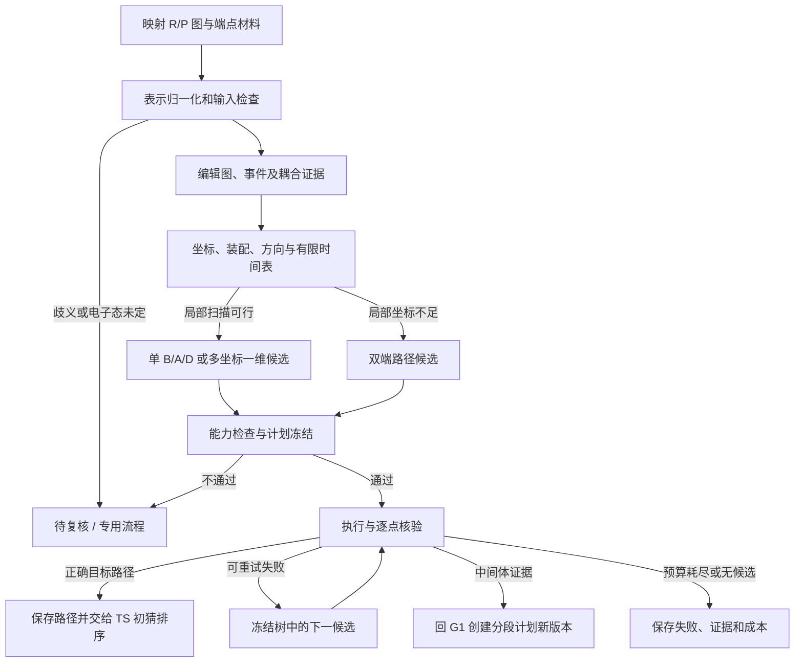

# PES GENERATION：以化学图论为核心的一维扫描策略选择器

> 设计版 v1 · 2026-09-30。交付范围：选择逻辑、数据合同、ORCA/ACP 能力边界、Demo24 逐条建议和实施验收。本文尚未实现生产选择器，也未提交量化计算。所有策略都是可验证的路径假设。

> **实施并轨（2026-09-30）：** 实施采用 G1 `v2-scan-*` 外部壳（CLI / 产物树 / schema 家族纪律）+ `pes2ts_core/scan_strategy/` 内部包；提案与计划的命名映射、验收口径与放行条件见[扫描规划谱系合并方案](../plans/PES2TS_扫描规划谱系合并方案_20260930.md)。

## 1. 设计结论

选择器应输出**有限、有依据、有明确失败出口的路径候选集合**。基本流程为：

**映射 R/P 完整图 → 表示归一化 → 反应编辑图与事件耦合图 → 几何可行性 → 驱动/监测/辅助约束 → 方向及时间表 → 后端能力校验 → 冻结候选。**

“适配所有类型”定义为：每个输入都得到可执行候选、待复核记录、专用路径路由或明确拒绝。它不能定义成“所有反应都由一条距离扫描找出正确 TS”。单一电荷与电子态下的 ORCA 松弛扫描不能普遍解决跨自旋面、显式电子交换、光化学交叉或缺失反应物的问题。

一维扫描统一用一个进度参数 `λ∈[0,1]`。可以有一个 B/A/D 坐标，也可以有 2–3 个坐标共同随 λ 改变。**参数维数、约束数量、图编辑数分别记录**。NEB 的结果可表示为一条能量剖面，但其优化是图像链搜索；进入 NEB 必须记录为退出原生 Scan 分支，不能算作 Scan 成功。

本设计优先复用现有“方向无关键合锚点”和“一维优先”原则；用下面的图结构与几何判据补齐旧文档中仅凭 F/B 数量作方向选择的部分。8 个 stratum 继续用于样本分层和报表，禁止成为策略判断的输入。

### 本次交付

- [Demo24 逐条建议](E:/Calculations/AI4S_ML_Studys/PES2TS/outputs/pes_generation_strategy_design_v1/Demo24_逐条扫描策略建议.md)：每条的编辑图特征、实际 map 对、驱动/观察坐标、建议方向、回退及风险。
- [机器可读证据](E:/Calculations/AI4S_ML_Studys/PES2TS/outputs/pes_generation_strategy_design_v1/demo24_strategy_evidence.json)：端点距离、图分量、循环秩、H 事件、芳香区域、原子属性变化及输入哈希。
- 24 条均保持 `needs_review`；6 条单坐标、15 条多坐标一维、3 条双端路径优先，是设计候选分配，不是计算成功数。

## 2. 当前代码与必须补齐的接口

| 位置 | 已核对的实际行为 | 设计要求 |
| --- | --- | --- |
| [planning.py](E:/Calculations/AI4S_ML_Studys/PES2TS/pes2ts_core/planning.py) | 只接受 ready 案例；支持一个连接编辑，或单个完整 H 转移且没有额外连接编辑；键级变化作为观察量；按端点距离线性取点 | 保留旧函数为 v1 基线，新选择器独立提供多候选和可解释路由 |
| [reaction_case.py](E:/Calculations/AI4S_ML_Studys/PES2TS/pes2ts_core/g1/reaction_case.py) | ReactionCase 保存元素、map、坐标、端点总电荷/多重度、编辑和 H 转移；未带完整键图、逐原子电荷/自由基、完整立体和芳香区域 | 新增经白名单校验且带哈希的 EndpointGraphBundle；不能只靠 edits 推断环、共轭及不变骨架 |
| [contracts.py](E:/Calculations/AI4S_ML_Studys/PES2TS/pes2ts_core/contracts.py) | ScanPlan 要求非空 coordinates、angstrom、3–101 点；表面数量上限为 4 | 按 mode/backend 校验；B/A/D 单位不同；NEB 无 Scan 坐标，需新合同或独立路径请求 |
| [adapter.py](E:/Calculations/AI4S_ML_Studys/PES2TS/pes2ts_core/integration/acp/adapter.py) | 尽管有同步点数预检，最终只接受一个距离、等间隔点列 | 未扩展前显式拒绝 COUPLED/STAGED/A/D/非均匀点列，禁止只投影第一根驱动键 |
| [trajectory.py](E:/Calculations/AI4S_ML_Studys/PES2TS/pes2ts_core/integration/acp/trajectory.py) 与 [quality.py](E:/Calculations/AI4S_ML_Studys/PES2TS/pes2ts_core/integration/acp/quality.py) | 扫描投影和质量判断以第一根驱动为主；技术可用性不等于化学目标完成 | 每帧保存所有目标值、实测值、残差、监测量；另建目标反应质量判断 |
| [Demo24 manifest](E:/Calculations/AI4S_ML_Studys/PES2TS/data/manifests/demo24_reaction_case_manifest_v1.json) | 24 条均 needs_review；来源组分多重度已解析为 R/P 各 1 | 仍需正式化学、几何与扫描资格复核；来源自旋已解析不能替代电子态审查 |

本次环境 PATH 未发现 `orca`；本文的输入片段依据官方手册，尚未在目标安装运行。ACP 的完整能力以具体 checkout 的探测及冒烟结果为准，不能从上述数量上限推断。

## 3. 输入规范与化学表示

### 3.1 EndpointGraphBundle：完整图是必需输入

对两端分别保存 `G_R=(V,E_R)`、`G_P=(V,E_P)`，以及共同 map 顺序的坐标：

- 原子：`map_id / element / isotope / formal_charge / radical_electrons / explicit_H_neighbors / aromatic / stereo`。
- 键：无序 map 对、连接类型、数值键级或 aromatic 标签、立体标签；配位键类型单独保留。
- 组分：每端各自的 component ID、局部索引、总电荷/多重度及来源。R0 与 P0 的编号没有天然对应关系，按 map 集合比较。
- 几何：原始几何、统一 map 顺序几何、装配/优化后几何分别保存引用与 SHA256；记录单位。
- 元数据：映射等价类、来源、归一化规则版本、工具版本、原始图和归一化图各自哈希。

普通化学反应要求同一 map 的元素和同位素守恒。元素改变、map 重复、原子不守恒是输入错误，不能当普通“属性变化”继续扫描。缺显式 H 时必须先完成两侧一致的氢原子清点和映射；不能单侧 `AddHs` 后直接比较。

现有 sanitized export 也没有完整键表。Demo24 本次使用候选 CSV 的映射 SMILES 补全，并逐键对照导出 edits，24 条全部一致；生产版应把完整图加入白名单导出，避免选择器回读含 TS/IRC 信息的原始数据。

### 3.2 表示归一化与映射歧义

1. 固定芳香性模型及 RDKit 版本；保存原始 Kekulé/芳香表示，在同一规则下比较。RDKit 支持不同芳香性模型，因此版本和模型属于计算输入。[RDKit Book](https://www.rdkit.org/docs/RDKit_Book.html)
2. 只在连接、同位素、显式 H 位置、电子计数及允许的立体信息一致时，判定两个共振表示等价。**互变异构体不是表示噪声**，不能用互变异构标准化抹掉 H 转移。
3. 芳香区域的键级差异压缩成区域事件，仍保留逐键证据；区域边界上的真实成断键不删除。芳香化/去芳香化也可能是真实化学变化。
4. 对映射等价类做有限候选检验：映射变化若仅交换等价 H/对称原子且给出等价策略，可折叠并保存置换；若改变供受体、立体目标或驱动键集合，则 `MAP_AMBIGUOUS`。禁止为了减少编辑数任意重新映射。
5. 映射与几何置换必须一起更新。同一分子图的 CIP 名称变化不自动意味着真实手性反转，比较基于映射邻居顺序的几何手性。
6. 原子形式电荷/自由基变化是电子态复核提示，不直接决定总多重度。固定总多重度也不保证沿路径始终跟随同一电子态，执行时仍检查电子收敛与态连续性。

对总电荷不同、粒子数不同、需跨自旋面或激发态交叉的案例，输出 `SPECIAL_ELECTRONIC_STATE_REQUIRED`，交给定义清楚的专用流程；不能将普通 NEB 当万能回退。ORCA 提供独立的 MECP 优化功能处理两势能面的交叉问题。[ORCA MECP](https://www.faccts.de/docs/orca/6.1/manual/contents/structurereactivity/mecp.html)

## 4. 三层图结构

### 4.1 原子级反应编辑图 ΔG

顶点包含所有发生键或原子属性变化的 map，属性变化但无编辑边的原子也保留。边按无序 map 对唯一标注：

```text
formed：R 无连接，P 有连接
broken：R 有连接，P 无连接
order_changed：两端都有连接，归一化后键级不同
```

属性变化独立存为 `atom_events`。同一对原子升键级只能记一次 O，不能同时重复计 F/B。

至少输出：F/B/O、重原子与 H 编辑、编辑度数、中心原子、F/B 图和 F/B/O 图各自连通分量、循环秩 `|E|−|V|+C`。编辑图循环不等于实际环，编辑图连通也不等于协同机理。

### 4.2 端点上下文图

只含编辑边会丢掉将事件相连的不变骨架。例如两根新键互不相交，仍可能属于同一次环化。因此查询完整端点图：

- 成键 `(a,b)`：R 中 a→b 的不变/已有连接路径；断键则检查 P 中剩余连接路径。记录支持路径，不只记录“在环内”。
- R/P 桥边、环成员、双连通块与循环秩变化；不要依赖任意选取的一组 SSSR 环作为唯一分类依据。
- 最短支持路径、局部共轭路径、端点芳香区域及其边界；编辑中心周边默认取 2 个键的局部环境，并把必要支持路径纳入。
- 同组分内/跨组分事件；图上不变的旁观组分保持在体系中，是否参与催化需由计算或人工证据判断。

`context_radius=2` 是首版可配置工程默认，不是机理的空间范围。强耦合规则没有覆盖的远程变化必须显式保留，不能因为扩大邻域后“全图连通”就视为单中心反应。

### 4.3 事件耦合图 H

把编辑合并为有化学含义的事件节点；事件之间记录类型化连接或超边：

| 事件或联系 | 图上的必要证据 | 能推断到哪里 |
| --- | --- | --- |
| `H_TRANSFER(D,H,A)` | 同一显式 H：唯一旧重原子邻居 D、唯一新重原子邻居 A；对应一断一成 | H 的连接切换；不能区分质子转移/H 原子转移/PCET 的电子机理 |
| `H2_EVENT` | 含 H–H 成断或伙伴交换，连同相关 X–H 编辑 | H2 事件单独建模；按 H–H 无序对去重，避免把两个 H 记录算两次反应 |
| `CONNECTIVITY_EXCHANGE` | 一成一断共享原子，附带局部骨架路径与属性变化 | 连接交换候选；共享原子可能是迁移基团，不能自动叫作 SN2 中心 |
| `RING_REORGANIZATION` | 编辑边与端点支持路径共同构成闭环/开环证据 | 同一环变化候选；不声称周环或协同机理已确定 |
| `DELOCALIZED_REGION` | 同一归一化芳香/共轭区域内的 O 或电荷重排 | 区域电子重排；不逐边设置扫描 |
| `SHARED_CENTER` | 两事件共享非旁观的反应中心原子 | 强局部关联候选 |
| `CONTEXT_NEAR` | 通过不变骨架短路径相连，但没有上述证据 | 弱关联，不能仅由其传递闭包合并事件 |

耦合图分别输出 `strong_components` 与弱联系。规则必须返回 `rule_id、support_atom_maps、support_edges、evidence_level`。同一分子的两个远端编辑不会因“属于同一分子”自动同步。多个强分量也不证明分步，只增加“分阶段/双端路径”的候选优先级。

## 5. 策略类别与选择优先级

采用**主策略 + 多个结构标签 + 编译模式**三字段。H2、芳香、环、重原子耦合可以同时存在；使用互斥大类覆盖全部标签会漏掉复合机制。

### 5.1 路由次序

1. 输入守恒、映射、电子态和必要几何错误先分流；待审案例可生成设计草案，不能生成 ready 作业。
2. 去除经证明的表示差异；若没有连接/电子/立体/构象目标变化，返回 `NO_REACTION_CHANGE`。
3. 构造 H2、H 转移、连接交换、环/芳香等事件及耦合证据。
4. 无连接变化：有清楚立体/构象变化则考虑 A/D；只有电子态变化走专用流程；其余 O 网络没有可解释几何驱动时走双端路径或复核。
5. 对每个事件分量生成可解释的坐标集合，检查是否存在 1、2、3 个驱动的合理候选。
6. 同时生成适用的方向/有限时间表，按硬门槛过滤、按优先序排序，再应用全反应预算。
7. 原生扫描不适用时输出 PATH/NEB 的显式路由；该后端也不具备所需能力则待审/拒绝，记录原因。

对应的核心接口建议为 `propose_strategies(case, endpoint_graphs, policy, capabilities)`，输出草案，不提交计算：

```python
def propose_strategies(case, graphs, policy, capabilities):
    normalized, input_findings = normalize_and_check(case, graphs, policy)
    if input_findings.block_graph_interpretation:
        return review_or_reject(input_findings)
    features = build_edit_context_and_event_graphs(normalized)
    motifs = match_all_applicable_motifs(features)  # 不按 stratum 分派
    candidates, reasons = [], []
    for template in applicable_templates(motifs, features):
        for proposal in template.propose(features, policy):
            # 方向、装配、坐标集合与时间表都属于 proposal 身份
            assessed = check_event_coverage_geometry_and_capability(
                proposal, case, policy, capabilities)
            if assessed.chemically_plannable:
                # 后端尚不支持的草案仍保存，can_execute=False
                candidates.append(assessed)
            else:
                reasons.extend(assessed.reasons)
    # 无局部扫描或需回退时，只加入满足电子态/端点前提的具体路径后端
    candidates = attach_path_fallback_proposals(
        candidates, features, policy, capabilities)
    candidates = deduplicate_rank_and_budget(candidates, policy)
    return seal_proposal(case, features, candidates, reasons,
                         execution_eligible=all_release_gates_pass(
                             case, runnable_subgraph(candidates)))
```

此处为职责伪代码。`all_release_gates_pass` 对空执行子图返回 false，并核验保留的回退引用均有定义。单个失败候选的原因与全案阻断原因分别保存；某个不合格候选不能误使其他合法候选也消失，反之全案阻断也不能被候选存在掩盖。

### 5.2 策略注册表

| 主策略 | 必要图模式 | 首选驱动 | 监测目标 | 升级/回退条件 |
| --- | --- | --- | --- | --- |
| `LOCAL_CONNECTIVITY` | 一处局部连接改变；允许有局部 O | 一根形成/断裂 B；环开闭也可适用 | 全部 O、局部环几何、非目标连接与立体 | 目标不随动或跳支：反向、预组织、NEB |
| `H_TRANSFER` | 一个完整重原子 D–H→A 事件，无额外连接变化 | 首试一根 H–A 或 D–H B；另一根监测 | 两根 H 距离、D–A、∠DHA、相邻电子重排 | H 被其他原子捕获/伙伴不变：双 B；取向失败先装配/预组织；再 NEB |
| `CONNECTIVITY_EXCHANGE` | 成断键共享原子且有完整局部上下文 | 成键 B + 断键 B | 共轭 O、中心手性、接近方向 | 早/晚时间表与反向；稳定中间体证据后分段；NEB |
| `H_TRANSFER_COUPLED` | H 转移和重原子变化相连 | 主重原子 B + 一个 H B；必要时加另一 H B | 未驱动 H 距离、全重原子目标及区域电子态 | 三个驱动仍无法覆盖事件：NEB；不省略额外中心 |
| `RING_COUPLED` | 多编辑通过同一局部环支撑结构相连 | 1–3 个关键连接 B，必要时 A/D | 其余编辑、环扭曲、构型及碰撞 | 过约束、角度退化或明显异步：时间表变体/NEB |
| `H2_EVENT` | H–H 与相关 X–H 连接变化 | H–H + 1–2 根相关 X–H B | 所有原伙伴、H2 位置/朝向、附加重原子事件 | 额外事件缺乏随动依据、三距离不可行、多片段装配失败：NEB/复核 |
| `AROMATIC_COUPLED` | 区域电子重排伴真实连接/H/环事件 | 优先扫描区域边界真实连接或 H；必要时一个有解释的 A/D | 区域键长分布、平面性、可用的电子键级指标、全部边界连接 | 无可靠结构驱动：NEB；只有表示变化则 NO_REACTION_CHANGE |
| `MULTI_EVENT_CONNECTED` | 多事件相连，但时序未知 | 经证据覆盖的 ≤3 B/A/D 组合 | 所有未约束事件，尤其离去键/第二 H 键 | 无法覆盖/观察不随动：NEB；稳定中间体确认后分段 |
| `CONFORMATION_STEREO` | 无连接差异或构象是明确前置步骤 | A 或 D；手性翻转另需几何验证 | 目标构型、骨架拓扑、非目标接触 | 共线、旋转路径分叉、翻转坐标不足：NEB/专用模板 |
| `NETWORK_PATH` | 多强分量、密集重排、所需驱动超限或无合适局部坐标 | 双端图像链，不编造单键驱动 | 全事件及端点身份 | 端点或电子态不合格则复核；有中间体再分段 |
| `SPECIAL_DOMAIN` | 配位/金属、表面/周期、电子交换、激发态等需专用表示/方法 | 经验证的专用插件/后端 | 领域相关目标 | 能力缺失时显式 unsupported，绝不套通用共价半径规则 |

这张表涵盖路由责任。Demo24 仅涉及 C/H/N/O/F/Cl、小分子和来源单重态，不能据此宣称金属、有机金属、催化、自由基、溶液多体反应都已验证。

## 6. 从图事件选择几何坐标

### 6.1 四种角色分开记录

- **driver**：真正随 λ 变化的约束，用于生成路径。
- **monitor**：全程测量且参与判断，不施加约束。所有编辑都有监测定义，包括 driver 自身。
- **guard**：有明确理由的辅助取向/局部约束，必须有启用范围、释放点、物理影响和预算；默认为空。
- **target_test**：末端或释放约束后判断目标反应是否完成，例如断键、芳香区域重排、立体关系。

不能把“monitor”悄悄编译成 ORCA 约束，也不能给所有未变骨架加固定约束。guard 不是逃避约束数上限的办法：凡随 λ 变化的量都计入驱动数量；静态约束同样计入几何约束秩和过约束检查。

### 6.2 坐标池与事件覆盖

从 F/B 生成 B，从 H 事件生成两伙伴距离、D–A 和 ∠DHA，从闭环/进攻几何生成局部 A/D，从构象差异生成有稳定参考原子的 D。O 通常是监测项；只有存在清楚结构意义和足够几何变化时才提名为 B 驱动，不能把形式键级数当几何坐标。

每个 driver 集合 `Q` 保存 `event_coverage`：

```text
direct：事件的一条必要连接由 Q 直接改变
coupled_monitor：事件未直接驱动，但有明确同中心/同 H/同环/区域联系；列出依据及失败测试
uncovered：没有以上依据
```

任何 `uncovered` 事件都阻止该候选成为默认自动扫描；它可保留为标明用途的消融探针。`coupled_monitor` 只允许提出假设，实际是否完成由路径结果判断。

生成候选时遍历有结构意义的 1–3 坐标组合，先去重、再约束预算。选择目标按顺序为：无 uncovered → 几何合格 → 电子态/装配可靠 → 约束更少 → 随动假设更少 → 成本更低。用稳定 map 顺序打破纯技术平局；不能用 map 大小判断化学优劣。

### 6.3 几何可行性门槛

1. 坐标定义、单位与索引正确；无重复原子；B 距离正；A/D 在两端和候选点不退化；D 做周期展开，跨 ±180° 不直接线性跳跃。
2. 端点图与几何核验：已成键距离合理；无非目标严重重叠；目标未成键接触若与图矛盾须先核对装配/映射。半径阈值按元素对、键型、方法配置，不能把现有 0.45–8 Å 粗门槛作为化学资格。
3. 多 B 时间表逐点检查三角不等式及更一般距离几何可实现性；H2 三距离尤其重要。H 转移的两根 B 需允许 D–A 与角度合理松弛。
4. 对按单位尺度归一化的约束 Jacobian `J=∂q/∂x` 做秩/条件数检查；重复坐标去重，近退化或矛盾约束拒绝。局部满秩不证明全路径无碰撞，不证明它是正确反应坐标。
5. 用端点刚体装配、约束投影或廉价几何预检检查初始路径与碰撞；这些几何插值只作预检，不能当已计算 PES 或中间体。
6. 起点的目标坐标必须与起始几何接近。大的首点跃迁先用独立准备步骤；禁止把预组织能量混入反应扫描曲线。

几何阈值统一保存在版本化 policy，按元素/方法维护。数值未通过训练开发样本校准和目标后端冒烟前，不生成 ready 计划。

## 7. 起点、方向与多组分装配

原始 R/P 身份永远保留；候选可以从任何合格一侧开始。每条候选记录 `start_endpoint、direction、assembly_id、anchor_reason`。

方向选择是分层比较：

1. 已完成电子态与几何复核的一侧优先；两侧都必须具备可用的目标定义。
2. 选定的 driver 在起点有真实已成键定位，且能减少片段摆放自由度的一侧优先。
3. 起点构型、局部进攻取向和未驱动事件覆盖优先于 F/B 的总数。
4. 仍平局时保留两个方向；首轮可用确定性顺序，不把微小几何评分差当作机理证据。

F>B 时从 P 拉伸、B>F 时从 R 拉伸可保留为便宜的候选优先先验；其优先级低于上述几何与事件覆盖门槛。H 转移两端都有 H–伙伴成键，必须比较供受体几何；不固定“永远 P 优先”。

反向候选除了坐标序列反转，还需独立起始优化与装配核验。若正向时间表是 `q(λ)`，严格配对的反向是 `q(1−λ)`；另设时间表的反向候选必须另编号。执行输出保留原始帧顺序，并提供规范 R→P 的索引映射；反向高点不能未经核验与正向曲线拼接。

### 多组分装配

- 保存各组分内部几何；按未变骨架作刚体对齐，重新确定相对平移/旋转。不能假定源文件中独立组分坐标在共同物理框架内。
- 根据反应中心生成有限接近构型，例如 H2 轴向、进攻原子到中心的方向；记录种子、变换、碰撞检查和保留原因。
- 预复合物/解离末端采用有限距离与取向，明确其环境定义。装配通过后才重新测 driver 起止值。
- 旁观组分默认保留；删除 HCl、溶剂、催化片段或固定整片段是改变模型的选择，须形成单独版本。
- 两侧同方法的端点准备若优化到另一拓扑，记为 `ENDPOINT_UNSTABLE_AT_METHOD`；不要为保住输入标签而长期冻结所有键。

## 8. 一维时间表、分阶段与执行模式

定义局部约束优化：

```text
q_j(λ_i) = q_j(start) + s_j(λ_i) [q_j(end) − q_j(start)]
x_i ≈ local argmin E(x), subject to q_j(x)=q_j(λ_i)
```

其余自由度在每点优化；结果依赖起始分支。这是预设约束路径，不保证最低能路径或唯一反应通道。

| 模式 | 参数维数 / 驱动数 | 执行方式 | 结果解释 |
| --- | --- | --- | --- |
| `SINGLE_1D` | 1 / 1 | 单 B/A/D Scan | 单坐标松弛曲线 |
| `COUPLED_1D` | 1 / 2–3 | `Simul_Scan true`，同 λ 索引 | 单参数多约束曲线；与真实同步机理分别命名 |
| `SCHEDULED_1D` | 1 / 项目默认 ≤3 | 自定义列表经验证后原生执行，或逐点多约束优化 | 可以异步、分段平滑；编译策略必须冻结 |
| `STAGED_1D` | 每段 1 / 每段 ≤3 | 独立局部路径 + 已验证中间体连接 | 多段路径；不得声称只有一个 TS |
| `PATH_REQUIRED` | 无预设 Scan 进度 | ORCA NEB；其他 PATH 算法需具体 backend ID | 图像链收敛后用弧长展示一维剖面 |

ORCA 6.1 手册规定原生扫描坐标 B/A/D，最多三个；多个 Scan 默认是嵌套网格，使用 `Simul_Scan true` 才按同一步号变化。它还明确说明结果会依赖方向/坐标顺序。[ORCA Surface Scans](https://www.faccts.de/docs/orca/6.1/manual/contents/structurereactivity/optimizations_scans.html)

### 8.1 首版有限时间表

- `linear`：`s_j=λ`，作为基线。
- `event_A_early` / `event_A_late`：只对耦合图中能解释的两个事件组定义偏早/偏晚；不按每根键穷举排列。
- 平滑时间窗可用 `u=clip((λ−a)/(b−a),0,1)`、`s=3u²−2u³`；端点不变，所有 driver 使用同一 λ 列表。
- 第一版最多三个时间表、两个方向；装配和模式候选共享总预算。此上限为工程起点，须写入 policy，不能在运行中无限加候选。
- 非均匀/非线性列表与 Simul_Scan 的组合要在具体 ORCA 版本先冒烟；当前 ACP 等间隔单 B 接口不能表达，必须拒绝或走经过验证的逐点执行器。

扫描 D–H 与 A–H 两距离并不等价于只约束差值 `d(D,H)−d(A,H)`：前者同时规定两个几何量，约束更强。差值默认作为 monitor；除非存在经验证的广义坐标后端，不能把它写成单个原生 B。

### 8.2 分阶段的证据要求

编辑分量、多个峰或局部低谷仅能提出中间体假设。分段条件为：候选中间帧解除反应约束后优化到稳定结构，确认拓扑/电荷/电子态；需要正式中间体结论时进一步做 Hessian/频率核验。

中间体未生成前无法冻结其真实坐标与下一段端点。因此采用两级流程：G1 预先冻结“中间体探索/判定规则”；G2 返回证据后，G1 创建带中间体哈希的**新计划版本**。原计划不变，G2 不自行补新段或修改 driver。原生扫描中让某个坐标暂时保持不变只是时间表，不自动成为有中间体的分步机理。

NEB 也可能发现中间极小值，不能保证直接得到单一基元过程。ORCA 手册建议对存在深中间体的路径分别处理相邻段。[ORCA NEB](https://www.faccts.de/docs/orca/6.1/manual/contents/structurereactivity/neb.html)

### 8.3 点数与预算

首版继承 9 点作为粗路径基线，`n_points∈[3,101]` 与现有合同一致；9 点只用于开发冒烟，不能保证解析到窄势垒。正式点数应受坐标最大步长约束：

```text
N_required = 1 + max_j ceil(total_variation(q_j) / max_step_j)
N = max(N_baseline, N_required)
```

若 N 超过后端上限，分段、换路径方法或拒绝；不能简单截断后仍声称满足分辨率。`max_step_B/A/D` 及残差容差按方法/坐标类型在 policy 中冻结，待试点校准。

自适应加密只允许从预冻结树中选新候选，例如 N→2N−1、局部加密区间及最大次数；新输入和哈希必须落账。预算包括所有方向、装配、时间表、每点优化重试和端点准备；`Σ constrained_optimizations` 不是实际核时，SCF/优化迭代成本仍须实测。任一累计预算耗尽就终止后续候选并保存已得路径。

可用于首轮开发的候选规模上限是：每反应最多 2 个端点装配、总计 6 个 Scan 候选、1 个初始 NEB 候选；每点最多 1 次额外优化重试。所有上限取全局预算与该案例预算中更严格者；这个示例不授权真实计算，也不替代已有冻结预算。上限截去的候选记录 `PRUNED_BY_BUDGET`，不能假装从未提出。

## 9. ORCA 与 ACP 编译边界

### 9.1 能力注册表

| 能力 | ORCA 6.1 手册层面 | 当前 PES2TS→ACP 投影 | 首版处理 |
| --- | --- | --- | --- |
| 等间隔单 B | 支持 | 支持 | 保留基线 |
| A/D | 支持 | 不支持 | 扩展类型、单位、残差与周期处理后启用 |
| 2–3 坐标同步 | 支持 | 不支持 | 新 adapter/compiler 冒烟通过后启用 |
| 非均匀点列 | 手册给出 B 自定义列表；具体组合需验证 | 不支持 | 条件能力；不可丢失中间点 |
| 一般多约束优化 | 支持 B/A/D 等约束 | 本轮未验证逐点编排能力 | 新执行器，保留每步约束和上一帧引用 |
| NEB | 专门的路径计算模式 | 当前 ScanPlan 投影不支持 | 独立 PathRequest 与回收协议 |
| 4 个原生 Scan | 不符合本设计所依据的三坐标上限 | 合同表面上限 4 不等于可执行 | 按有效能力的交集拒绝 |

通用 `%geom Constraints` 的约束数与原生 `Scan` 的三坐标限制是两回事；逐点约束执行理论上可以表达更多约束，但本项目默认仍设 ≤3 个 driver，超过者需单独证据与策略，不能用此绕过降维验证。约束语法依据 [ORCA Constrained Optimizations](https://www.faccts.de/docs/orca/6.1/manual/contents/structurereactivity/optimizations.html)。

注册表至少包含 `engine_version、adapter_version、supported_modes、coordinate_kinds、max_scan_coordinates、point_limits、custom_schedule_support、constraint_support、method/element_coverage、probe_receipts`。`effective_capability` 取引擎、适配器和部署配置交集；未知能力视为未启用。独立 xTB 与 ORCA 调用 xTB 也要分开登记，不能混用约束语义。

### 9.2 一个可检查的编译示意

以 `RXN_0000161724` 的 H13：O4→N5 为例，下面是从 P 返回 R 的双 B **语法片段**。map→索引来自共同 atom 顺序，此样本 map 4/5/13 分别为 ORCA 3/4/12；一般情况下不能直接 `map−1`。

```text
%geom
  Scan B 3 12 = 1.957, 0.966, 9 end
  Scan B 4 12 = 1.017, 2.011, 9 end
  Simul_Scan true
end
```

这是以原始端点距离四舍五入的说明，不是提交文件。正式编译需使用复核/优化后几何、完整精度、方法、资源、总电荷/多重度和 XYZ；对每个目标点重算可行性。第一候选仍可只扫描 N5–H13，O4–H13 作为观察量，比较增加第二根约束是否有收益。

逐点执行器编译第 i 点为同一方法的多约束 Opt，读取上一**合格**帧；失败不能复用失败几何。每步输入、实际几何、能量、收敛、重试都保留。多 XYZ 单点计算只用于已有结构补能量，不承担路径生成。

## 10. 输出合同与状态机

### 10.1 StrategyProposal 与 ExecutablePlan 分离

`StrategyProposal` 可由待复核输入生成，用于设计和人工审查；其 `execution_eligible=false`。只有案例、端点装配、坐标、预算和有效后端能力全部合格，才创建 v2 执行计划。

建议合同包括：

```text
StrategyProposal
  identity: reaction_id, case_id, split, source_case_sha256
  graph_input: endpoint_graph_sha256, normalization_version, mapping_equivalence
  graph_features: edit_components, context_support, events, typed_couplings
  family, motif_tags, rule_trace, epistemic_status=endpoint_hypothesis
  candidates[]:
    mode, start_endpoint, direction, assembly_id
    drivers[]: kind=B|A|D, maps, index0, unit, schedule_values
    monitors[]: measurement, maps/region, target_test, evidence_available
    guards[]: kind, values, active_interval, release_rule, rationale
    event_coverage[], lambda_values, schedule_id
    required_capabilities, capability_check
    expected_cost, budget, run_if, pass_if, fallback_ids
  execution_eligible, reasons[]

ExecutablePlan v2
  source proposal + reviewed case + endpoint assemblies + policy hashes
  backend/version/method/resources/electronic state
  candidate graph with immutable node IDs and explicit terminal states
  compiled input/XYZ hashes or sealed per-point input-generation recipe
  all coordinates, monitoring tests, numeric tolerances and budgets frozen
```

mode 校验按判别联合实现：Scan 候选必须有合法 driver；Path 候选必须有同原子顺序的两端几何和图像链参数；不为通过旧合同伪造一个“NEB 距离坐标”。实现上可用 `GenerationPlanV2` 包含 `ScanCandidateV2 | PathCandidateV1`，通过兼容层导出旧的单 B ScanPlan。

计划 ID/哈希包括规则版本、输入完整图、原子顺序、装配、全部坐标/时间表、方向、方法、资源预算、质量测试及回退树。改动任何执行行为都产生新版本。

### 10.2 冻结的失败树



失败触发应是枚举状态和可计算表达式，禁止仅用“效果不好”字符串：

| 代码 | 含义 | 动作 |
| --- | --- | --- |
| `MAP_INVALID / MAP_AMBIGUOUS` | 映射错误或影响路径的歧义 | 复核，无计算 |
| `REPRESENTATION_AMBIGUOUS` | 芳香/共振归一化无法确定 | 复核，不任意删编辑 |
| `ELECTRONIC_STATE_UNRESOLVED / SPECIAL_ELECTRONIC_STATE_REQUIRED` | 总态未知或需多势能面流程 | 专用分流；普通 NEB 也禁止 |
| `ASSEMBLY_REQUIRED / ENDPOINT_GEOMETRY_CONFLICT` | 相对片段位置未定义或图/几何冲突 | 端点装配后重建候选 |
| `ENDPOINT_UNSTABLE_AT_METHOD` | 准备优化改变目标端点 | 方法/端点复核 |
| `NO_VALID_DRIVER / EVENT_UNCOVERED` | 无可靠坐标或遗漏独立事件 | 双端路径或复核 |
| `CONSTRAINT_INFEASIBLE / COORDINATE_DEGENERATE` | 目标约束不可实现或退化 | 换合法候选；不删除一根坐标后继续 |
| `BACKEND_CAPABILITY_MISSING` | 引擎/ACP 无法完整表达计划 | 显式阻断，不降级投影 |
| `SCF_FAILED / OPT_FAILED / CONSTRAINT_RESIDUAL` | 数值或约束失败 | 有上限的预定义重试；再切换候选 |
| `WRONG_CONNECTIVITY / NON_TARGET_REACTION / STEREO_MISMATCH` | 未到目标或发生其他反应 | 反向/耦合升级/时间表/NEB，按冻结树执行 |
| `PATH_DISCONTINUITY / HYSTERESIS` | 相邻帧跳支或双向不同 | 冻结加密/另方向/NEB；不能用插值伪造连续性 |
| `INTERMEDIATE_CANDIDATE` | 发现可能的稳定中间体 | 完成预定义验证，再交 G1 新版分段 |
| `MONOTONIC_PROFILE / PEAK_NOT_BRACKETED` | 无内部峰或只见端点最高 | 不报目标 TS；按冻结窗口/方法候选处理 |
| `BUDGET_EXHAUSTED` | 累计预算达到上限 | 终止并保留所有结果 |

失败与候选 ID、点号、涉及 map 对、实际值、阈值、输入哈希关联。一个候选失败不等于反应被永久剔除；总反应分母保持完整。

## 11. 监测与验收：从技术路径到化学路径

### 11.1 每帧至少记录

`λ / stage_id / geometry_ref / energy_channel / convergence / all_driver_targets / all_driver_actuals / residuals / monitor_values / non_target_contacts / electronic_state_diagnostics / retry_history`。

若能量包含偏置或软约束势，应单独保存物理能量与偏置项；无法分离时标明通道语义，不与普通约束优化的能量混画。不同方法、电子态、单点精化与扫描能量分通道。

键长是连续监测量，键级不是由一个固定距离阈值精确决定。过渡区域不要求每帧都能赋唯一整数键级/形式电荷；记录 `unknown/transition`，不能因此误判路径失败。端点目标判断可组合元素对距离、方法可提供的电子键级/人口分析和释放约束后的拓扑/构型匹配；没有电子证据时，纯键级/芳香目标不能宣称已验证。

对普通距离可计算归一化进度 `p=(d−d_R)/(d_P−d_R)`；仅当端点差明显大于测量容差时使用。对芳香细小键长差、跨组分未装配距离和退化坐标不计算进度。各 monitor 可以异步和非单调，不强求与 λ 等速。异常跳跃、目标外近接和最终未完成才触发相应检查。

### 11.2 四个结果层级

1. `execution_complete`：作业和文件完整。
2. `numerically_usable`：逐帧收敛、所有约束满足、坐标/能量/方法一致，没有缺帧或明显几何错误。
3. `target_path_compatible`：未驱动目标编辑也完成，末端释放约束后匹配目标 R/P 等价类及构型，无非目标反应。只有端点完成还不够，路径连续性和过程中的副反应也要检查。
4. `validated_ts`：另行 TS 优化、符合目标运动的一阶虚频与双向 IRC/端点核验。无内部峰的有效关联/解离路径可能没有适用的 TS seed；不把端点最高能强报 TS。

质量提升必须逐层提供证据。现有 PathBundle 的 `usable` 继续表示技术含义，新增化学目标状态独立保存，避免改变旧评估口径而不留版本。

## 12. Demo24 的具体设计结果

详表给出全部 24 条 map 对和实测数值；摘要如下：

**24 条 F/B/O 编辑图全部只有一个连通分量。** 因而“编辑图是否连通”本身无法把这批反应分成简单/复杂扫描。若只看 F/B，94438、149368、17762、138453、47010、194484 各有两个分量，74997 有三个；它们又通过键级变化或不变骨架关联。这个结果直接支持采用“编辑图 + 端点上下文 + 类型化事件耦合”的三层结构。当前样本没有覆盖真正独立的多个强事件分量，实施测试需补充该情形。

| 分层 | 当前建议 | 主要依据与保留风险 |
| --- | --- | --- |
| A，3 条 | 单 H 距离优先；双 H 距离备选 | 识别了明确的供体/H/受体，电荷与局部 O 作监测 |
| B，3 条 | 单 B | 包含开闭环；79731 另有 O 和对称映射标记 |
| C，3 条 | 双 B 连接交换 | 共享的原子多为迁移片段上的原子，不能用 stratum 直接判 SN2 |
| D，3 条 | 双 B；需要时升级第三 B | 其中 132222 是闭环+H 转移；另外两条有未驱动断键 |
| E，3 条 | 三 B 条件候选，NEB 为主要回退 | 仍有 H/断键未直接驱动，降维是否成功须计算验证 |
| F，3 条 | H–H 与两个 X–H，装配后再定范围 | 三条均耦合重原子事件；不等于“普通 H 转移×2” |
| G，3 条 | 真实连接编辑的 2–3 B；芳香区域监测 | 7–8 等区域内 O 不逐根扫描；新增芳香连接必须保留 |
| H，3 条 | 双端路径优先 | 密集/分散重排缺乏可靠 ≤3 驱动覆盖；少成键端不能自动兜底 |

以下问题已由本次只读端点检查发现，并写入逐条风险：

- `RXN_0000149368`：P 的 C3–H13 按图已断裂且属于不同组分，原始距离 **0.754 Å**，H10–H13 为 0.744 Å。不能用该跨组分距离作为断键终点，先修复/核对装配。
- `RXN_0000109608`：R 的未来成键 3–4、3–5 分别为 **1.424、1.361 Å**，比 P 的 **1.493、1.439 Å** 更短；说明原始跨组分坐标不足以定义成键扫描窗口，需重新装配。
- `RXN_0000155302`：HCl 在两端图上不变，但仍在体系中；不能据“旁观组分”直接移除。
- `RXN_0000079731`：`resolved_symmetry_collapsed` 仍需确认等价映射不会改变扫描目标。
- `RXN_0000047010`：5–6 是产物键级 1.5 的真实新连接；芳香处理不得把它与区域键级重排一同抹掉。

这些诊断不替代正式人工 ReviewRecord。当前来源记录总电荷均 0、R/P 来源多重度均 1；不据此宣称全部闭壳层、化学合理或已可扫描。

## 13. 实施拆分与验收标准

### 13.1 模块边界

```text
g1/endpoint_graph.py       完整图白名单、规范化、图/几何身份
g1/reaction_edit_graph.py  原子级编辑、上下文、事件与类型化耦合
planning/features.py      几何与图特征，不读 TS/IRC
planning/strategies.py    注册表、候选坐标、事件覆盖和理由
planning/schedules.py     单参数时间表、周期角、有限候选树
planning/selector.py      过滤、排序、预算、状态输出
planning/capabilities.py  后端有效能力交集与探测回执
planning/compile_orca.py  Scan/Constraints/Path 请求编译
integration/acp/...       请求与多坐标逐帧结果的无损映射
quality/target_path.py    目标编辑、区域、立体与连续性检查
```

上面是建议职责，不要求同时创建所有包。现有 `planning.py` 名称与新 package 冲突需在实施时处理：先用 `scan_strategy/` 新包最小接入，保留公开函数；确认兼容后再决定是否迁移。

### 13.2 分四个交付阶段

| 阶段 | 工作 | 验收门槛 |
| --- | --- | --- |
| P0 输入与图 | 增加完整端点图、表示归一化、事件/耦合图；策略草案可处理 needs_review | Demo24 逐条证据与本附录对照；每个编辑恰有一个事件归属或明确共享关系；零真值几何/能量字段 |
| P1 单坐标选择器 | H/局部连接、双方向候选、全编辑监测；保留旧基线 | 单 B 请求无损通过现有 ACP；错误映射/几何/未审输入均有原因；支持拒绝合同 |
| P2 多坐标闭环 | COUPLED/SCHEDULED、完整能力合同、所有驱动的结果回收与质量检查 | 每个 driver 每帧目标/实测/残差可追踪；未支持能力拒绝；目标 ORCA 冒烟通过，无隐式网格 |
| P3 路径与分段 | NEB 请求/结果协议、中间体验证、新版分段计划；方向/时序对照 | NEB 与 Scan 分别计成本/成功；多峰/中间体不合并成一个 TS；失败树与预算可重放 |

完成 P0/P1 不代表完成 24 条生产覆盖；P2/P3 和正式复核通过才允许相应策略进入真实计算。生产 selector 不应硬编码这 24 个 reaction_id，逐条建议只作审查样例。

### 13.3 有意义的测试

- **图变换不变量**：map 重编号/原子顺序置换/端点刚体移动不改变等价策略；R/P 交换应正确互换 F/B、供受体和方向。
- **表示测试**：等价 Kekulé 表示不产生伪反应；真实芳香化/去芳香化和新增芳香键不被删掉；互变异构 H 事件保留。
- **路由测试**：单键、H/H2、连接交换、闭环/开环、无编辑构象、纯 O、多 H 接力、多个不相连中心、金属/电荷/自旋专用出口。
- **几何测试**：跨组分重叠、错误断键终点、三角不等式失败、A/D 共线与 ±180° 周期、等价 H 映射/手性目标。
- **编译测试**：同期步数与 λ 对齐；没有 Simul_Scan 时不能接受多 Scan 编译；3/4 坐标边界；B/A/D 单位/0 基下标；全部坐标回收，不能只读第一根。
- **状态测试**：不收敛、错误反应、未驱动键不变化、多峰、单调曲线、预算耗尽、中间体重规划；所有失败保留分母及费用。
- **后端冒烟**：小分子单 B、双 B、三 B、A/D、非均匀列表/逐点约束、NEB 分别记录 ORCA/ACP 版本和运行证据。只运行代表性有效组合，不用语法模型通过替代真实执行。

### 13.4 科学比较与数据划分

固定共同预算，比较旧单 B、图论单 B、耦合一维、有限时序/方向、NEB 的新增目标路径率与成本。每条反应是统计单位，候选成功数不能冒充反应成功数。

报告至少包括：全队列 N、输入待审/拒绝数、可编译数、实际运行数、数值可用数、目标相容路径数、严格 TS 数、总核时和单位成功成本；补充分策略家族结果及失败代码。

遵循本队列已有规则：16 条 train 用于开发，8 条 valid 在输入复核后锁定，不用于调策略阈值。若反复使用 valid 调参，应重新声明其开发用途并建立独立验证集；不要将其继续报告为独立验证。24 条是机制覆盖开发集合，不能估算全数据集成功率。

本队列既有映射来源为 `truth_assisted_p1`，历史入选 gate 也非完全独立于 IRC。此次规划只读白名单 R/P 材料、没有读取 TS/IRC 几何/能量，但不能因此声称整个评测端到端无真值辅助。正式泛化评测需端点独立映射与选择流程。

## 14. 完成定义

设计层完成意味着：对任意合法输入有明确路由；对能执行者输出完整、有版本的坐标和策略；对不能执行者保留原因和所需证据；全流程不将图连通性当作时序证据，也不将技术收敛当作目标反应成功。

本次已完成设计文档、Demo24 的端点图/距离证据和逐条策略草案。生产代码扩展、数值阈值校准、目标 ORCA/ACP 冒烟、24 条人工复核与真实路径/TS 验证属于后续实施工作。
