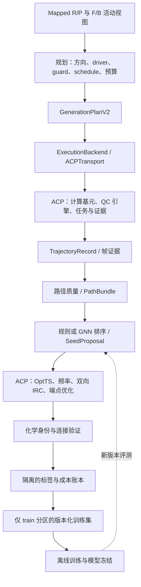

# PES2TS G2 后续开发方案：Classic → Rank → Gen

> 当前适用范围（2026-10-05）：保留本文 G2 物理闭环、严格验证、留数及成本任务。G3/G4 的独立 Rank/Gen 学习安排由 [PES-N 未来计划](PES2TS_PES-N未来开发计划_v2_20261005.md)及 [ADR-0010](../design/decisions/ADR-0010-PES-N反应状态价值与STOP-MOVE统一决策.md)取代；未来生产采用控制/原生优化分离，旧数值校正留作对照。下文先前“修改提案”指针及能力快照保留历史语境。

> 整体修改提案入口（2026-10-05）：[G0–G4 开发框架修改方案](PES2TS_G0-G4整体开发框架修改方案_v1_20261005.md)已整合后续 G/R 统一讨论与原子/自由度分工；本文 G2 工作及现行阶段门仍按已生效规范执行。

> 状态：当前开发方案；本文完成的是设计，未据此实施代码或启动计算
> 层级：G2.0–G2.4 / G2.T；衔接 G3；工作流 C/R/X
> 日期：2026-10-03
> 上游：[阶段定义](PES2TS_阶段定义_G0-G3.md)、[项目主方案](PES2TS_整体开发与发布方案_v2.md)、[ADR-0002](../design/decisions/ADR-0002-计算后端统一经ACP执行.md)
> 配套：[ACP 能力补齐与联合验收计划](PES2TS_G2_ACP能力补齐与联合验收计划_20261003.md)
> 数学与边界细化：[PES-G 迭代方案](PES2TS_G2_PESG收紧算法迭代方案_20261003.md)、[G1→G2 审计](PES2TS_G1_G2边界审计与补齐任务_20261003.md)。后者修订“输入整体 truth-free”的表述；当前代码事实以 HEAD 3a5c875 的核查为准。
> 取代范围：细化 G2 的生成、候选、验证、留数和验收顺序；修订“排序全部等到 G3”“验证结果一概不得用于训练”的旧表述；不另建主干编号

> 后续方向（Proposed，2026-10-04）：[统一价值模型与搜索排序一体化发展方案](PES2TS_统一价值模型与搜索排序一体化发展方案_v1_20261004.md)建议把 Rank 的学习产物并入 G/R 共享价值核心、把内部候选选择并入搜索；外部排序入口与独立评测保留。详见 [ADR-0007](../design/decisions/ADR-0007-统一价值模型与搜索内生选点.md)。本文 G2 工作和现行阶段/规范不因该指针自动改变。

> 取代关系：G2 工作承接；后续学习路线已由 PES-N 计划与 ADR-0010 取代
> 上游依赖：[开发宪法](../PES2TS_开发宪法_v1.md)、[阶段定义](PES2TS_阶段定义_G0-G3.md)
> 下游消费者：G2 执行/质量/验证工作包、ACP 联合验收
> 当前版本：v2 @ 2026-10-05（适用范围与元数据同步；原设计正文及能力快照保留）

## 1. 路线与本轮边界

**先建立 ACP 支撑的自动 PES→TS 物理基线，再学习候选排序，最后学习生成决策。目标是在保持目标反应验证成功率的条件下，降低每个 verified TS 的总计算成本。** “让 OptTS 主要负责局部精修”是待验证的性能目标，不是当前已实现的能力。

| 算法代际 / 对外名称 | 主干位置 | 开发内容 | 放行依据 |
|---|---|---|---|
| PES2TS-v1 / Classic | G2，延伸到 G3.0 | 图条件规划、廉价路径、规则选点、OptTS/频率/IRC/身份验证、全量证据 | 自动闭环、真实冒烟、失败可解释、成本可追溯 |
| PES2TS-v2 / Rank | G3.1–G3.2 | 固定 generation，学习目标 TS 成功概率与验证成本 | 同路径、同 QC 协议、同预算的独立对照 |
| PES2TS-v2 / Gen | G4，另行放行 | driver/guard、方向、时序、起点侧、停止/继续决策 | 固定 ranker 和验证器，比较全流程成本与覆盖 |

Classic/Rank/Gen 是算法路线名称；G0–G4 是工程阶段；`pes2ts-generation-v1` 等仍是发布单元。三者不能混作完成状态。

沿用已经裁决的范围：

- **G2 当前活动事件仅为完全成键 F、完全断键 B。** `order_changed` 归档，不生成 driver、guard、调度事件或覆盖要求。此次讨论中的“order-change coordinates”不恢复旧范围。纯键级变化返回 `OUT_OF_SCOPE_NO_CONNECTIVITY_EDIT`。详见[第二轮范围](PES2TS_第二轮修改最终方案_仅完全成断键_20261002.md)。
- 多个 F/B 可共享一个 λ；一维不等于单键。局部 A/D guard 默认关闭，仅按有来源的冻结候选启用。
- `endpoint_informed_single_ended`、固定双端模式、`reference_guided_diagnostic` 分别统计；不能用开放终点结果冒充固定完整双端通过。
- 所有能量、梯度、优化、Hessian、频率、IRC 和 NEB 计算均经 ACP。PES2TS 保留规划、数值策略、筛选与化学判定；RPH 保留候选消费和验证结果展示/编排角色，其 QC 请求同样经过 ACP。
- 保留 `ExecutionBackend → TrajectoryRecord → PathBundle → SeedProposal → ValidationResult`；旧 `g2_path_v1` 与 191,148 条旧产物只读，扩展用新版本或有哈希绑定的旁车记录。

## 2. 最新事实与尚未证明的能力

以下表为早先核查基线：PES2TS HEAD `b7ecd76`、ACP HEAD `6a8e79d`，**均结合当时工作区读取，不是冻结发布快照**。后续 HEAD `3a5c875` 已有 ACP OrcaGradient 客户端、归档直调实验层及部分路径候选；最新逐文件事实见 PES-G 方案 §13、ACP 联合计划 §2.1。历史科学结果不因代码迁移而自动更新。

| 事实 | 依据 | 对后续计划的含义 |
|---|---|---|
| 第二轮完整路径 6/24、部分路径 15/24、起点问题 3/24；未确认目标 TS | [根因分析报告](../reports/PES2TS_generation关键问题与根因分析_20261002.md) | 科学结果仍是原型，不能以回归测试数量替代成功率 |
| 第三轮 strict 的四例路径记录：1 完整、2 `LOCALITY_LIMIT`、1 `CACHED_GRADIENT_INPUT_MISMATCH` | `outputs/PES2TS_Demo24_round3_20261002/strict/paths_summary.json` | 已有局部校正实现，但稳定性与缓存身份仍需修复；不是新一轮 24 例统计 |
| strict 验证器校准记录使用参考种子，状态为 `RUN_FAILED:IRC` | 同目录 `validation_summary_calibration.json` | 参考校准不计生成成功；优先调通验证链 |
| `local_corrector.py`、`gradient_evidence.py`、`constrained_curvature.py` 已存在 | `generation/planning/` 当前代码 | 做审核、接线和定向修复，不重新编写同一原型；单方向曲率探针不能证明完整正定或真实分岔 |
| `continuation.py` 有物理梯度接受检查，但策略默认 `require_physical_gradient=False` | `ContinuationPolicy` 与接受分支 | 严格模式显式冻结开关，不能仅因存在字段就声称所有旧帧已验证 |
| `stage_cli.py` 已有 BatchOptimize→IRC；`stage_results.py::_match_endpoint` 主要按对齐 RMSD 匹配 | `integration/acp/` | 复用执行链，增加端点极小值与完整化学身份判定 |
| xTB 本地 runner、直接 cccp/ORCA 实验入口仍存在 | `generation/execution/xtb_path/runner.py`、`integration/acp/{continuation_backend,gradient_backend,seed_validation}.py` | ADR-0002 尚未完全落实，不允许把实验入口当正式 ACP 能力 |

未带 `strict/` 的旧第三轮回放不能覆盖严格结果。本次不重跑、不更改上述历史产物。

## 3. 外部参考：借什么，如何保持 ACP 核心后端

| 参考 | 已核实内容 | PES2TS 采用方式 | ACP 责任 |
|---|---|---|---|
| Rasmussen–Jensen / RMSD-PP | 低成本路径提名高能结构，后续 TS 搜索；100 例报告找到 89 个 TS | 建立可复现方法基线、有限重试和成功/失败留档；配方显式冻结 | 执行 xTB PATH、后续 QC 及产品落盘 |
| Chemoton 2.0 / NT2 | 反应复合物、轨迹、平滑峰提取、TS 优化、IRC、图验证的模块链 | 借用分层和事件/结构/计算身份设计；能量峰作为明确版本的基线 | 梯度、约束松弛、优化、频率、IRC；不引入第二套后台调度系统 |
| Chemoton 后续 NT2 改进 | 依据观测到的反应事件优先选事件前局部峰；必要时选事件后峰或最高局部峰 | 增设事件邻域峰规则对照，避免只与过弱基线比较 | 如需原生键级证据，先补能力；距离代理必须标注为代理 |
| KinBot | 反应家族启发式逐步调整几何，再交 QC 程序定位驻点 | 参考有限的家族策略与失败分类；转成 `StrategyProposal` | 继续由 ACP 执行，不复制项目的提交脚本 |

来源：[Rasmussen–Jensen 2020](https://peerj.com/articles/pchem-15.pdf)、[作者实现](https://github.com/jensengroup/RMSD_PP_TS)、[Chemoton 2.0 §3.2–3.4](https://arxiv.org/html/2202.13011)、[2024 NT2 改进](https://pmc.ncbi.nlm.nih.gov/articles/PMC11063077/)、[Puffin NT2 作业实现](https://github.com/qcscine/puffin/blob/master/scine_puffin/jobs/scine_react_complex_nt2.py)、[KinBot 原论文](https://www.sciencedirect.com/science/article/pii/S0010465519302978)、[作者仓库](https://github.com/zadorlab/KinBot)。引用的是这些具体版本的设计，不等同于对所有当前版本的概括。

RMSD-PP 的 **89/100 是特定数据、电子结构方法与验证协议下六次运行合并的文献覆盖率**；其余 11 例中论文讨论了 9 例非单基元反应。不能作为 Demo24/Reaction-QM 的预期通过率。复现时冻结原始 100 例清单、输入构象、xTB 参数、峰附近插值/DFT 单点、精修方法、重试和成功判据；若把原 Gaussian 路线改为 ACP/ORCA，应称“适配对照”，不能称严格复现。保留 100 例总分母，单基元子集另报。

NT2、RMSD-PP、硬约束延续是不同路径方法。借用候选提取不等于实现 NT2。完整 NT2 作为 ACP 梯度能力成熟后的可选方法，不阻塞 Classic 首次闭环。若后续移植代码，单独冻结源版本并核查许可证；本轮只做设计借鉴。

## 4. 模块和责任落点



按已有布局补模块，不再整仓改目录：

| 所属 | 复用 / 拟新增 | 职责 |
|---|---|---|
| `generation/planning/` | 复用 connectivity、coordinate_pool、direction、schedules、plan_freeze | 活动事件、坐标、方向、有限假说、可求值调度 |
| `generation/assembly/` | 复用 endpoints | 多组分装配与输入版本化 |
| `generation/planning/` → 后续可整理为 `generation/path/` | 复用 continuation、local_corrector、origin_preparation、gradient_evidence、constrained_curvature | 纯数值预测/校正策略、分支状态、步长与停止；本轮先不迁目录 |
| `generation/execution/` + `integration/acp/` | 复用协议；补 ACP 请求/回收与通用传输 | QC 执行唯一接缝，不 import cccp 引擎，不启动 xtb/orca 二进制 |
| `generation/quality/` | 从现有 target_path/quality 中接线 | 帧质量、连续性、部分路径资格 |
| `ranking/` | 拟拆 `descriptors.py`、`heuristic_ranker.py`；G3 才加 `gnn_ranker.py` | 同一输入合同，可替换的排序器 |
| `integration/validation.py` + `integration/acp/stage_*` | 复用并扩展；暂不新增平行 refinement 引擎 | 冻结验证协议、发起 ACP 阶段、绑定优化后 TS |
| `evaluation/` | 拟加 graph_identity、reaction_connection、label_export、cost_report | 结果判定、隔离标签、成本和基准报告 |

ACP 返回“计算发生了什么”；PES2TS 判断“是否为所请求的反应”。RPH 与 PES2TS 共用 ACP 产物，不各写一套 OptTS/IRC runner。在线化学质量逻辑只使用端点与当前计算证据，不导入离线 truth 数据。

## 5. G2 Classic 的最小闭环

### 5.1 起点、规划和预算

1. 冻结 G1→G2 边界、map 原子序、电子态、活动 F/B、输入哈希和工作方法。重叠修复保存新输入身份。
2. 先做同方法起点准备与完整身份检查。自由优化重排不能靠永久固定异常键伪装为有效起点；记录 `METHOD_INCONSISTENT_ORIGIN` 或原因未确定。
3. 默认比较 R/P 起点质量、已成键锚点和片段摆放自由度；P-first 是有解释的先验，不是普遍规则。
4. 冻结一个首选计划和有限 fallback 列表。同步与事件组相位差分别成版本；所有坐标共用 smoothstep 主要改变采样，不能当作新通道。
5. 初始预算建议：每路径目标约 10–30 个 accepted frame，候选 1–3 个；自适应可能产生更多帧。真正硬上限为 attempts、梯度调用、阶段时间和总核时，具体值在 train 校准后冻结。失败、拒绝、加密与回退都耗预算。

### 5.2 连续路径：先判断校正是否合格

R0–R4 延续原有研究次序，但优先通过 ACP 重现当前 strict 失败段：

- 做零推进、小推进、反向返回回放，保存预测几何、每次校正试探和拒绝输出；原子映射固定，只去掉全体系平移/旋转。
- 上一接受帧先满足约束驻点门，再当下一帧参考；检查实际约束残差、梯度精度与目标增量的关系。低于优化噪声的推进返回 `PRECISION_LIMIT`，不无限折半。
- 局部校正器固定本次预测中心，分别限制内部步长与累计位移；在边界卡住返回 `LOCALITY_LIMIT`。平滑但未达到自由方向梯度门的点不能接受。
- 在共同单位与尺度下，用 `g_free = P_T g_phys` 检查约束松弛；`g_phys` 必须是同一几何、同方法的原始物理梯度。投影梯度小不证明 TS；完整物理梯度小也不能单独证明 TS。
- 对少数持续失败段使用 Lagrangian 切空间曲率探针，注明方向、差分步长、约束定义和刚体去除方式。不要把单方向探针称为最小特征值或完整 Hessian 证书。
- 仅按冻结规则试局部 A/D guard、备用方向或另一调度；仍失败就保存有效前缀并退出。NEB/string 是有预算的后续回退，必须先有 ACP 能力收据。
- 软 guard、人工力及偏置若被启用，单列物理 E、bias E、优化目标；进入物理曲线与排名的能量通道要明确。原问题驻点需释放数值辅助后确认。

完整区间、有效前缀、候选可用性分别记账。**局部连续且证据完整的部分路径可提交候选**；不强制先跑到 λ=1。端点拼接、跳跃两侧和拒绝试探不得伪装成连续候选邻域。

### 5.3 G2 就实现规则选点，G3 再训练排名

保留现有 `highest_scan_energy` / `internal_scan_peak` 基线版本，新增严格资格过滤与以下策略；不能修改旧规则却继续沿用旧版本名。

| 策略 | 输入与行为 | 用途 |
|---|---|---|
| energy maximum | 在共同合格帧集合按物理相对能量排序 | 最低复杂度基线；端点是否纳入写入协议 |
| smoothed local peak | 在连续分段内找峰，再映射到已有真实帧 | 对照 Chemoton 2.0 的选点思路 |
| event-local peak | 用活动 F/B 事件邻域提名，证据不足回退到局部峰 | 更强规则对照；代理检测与原生键级检测分开命名 |
| heuristic basin | 局部峰证据 + 物理梯度 + 应变/图偏离诊断 + 候选去重 | Classic 主候选提取器，先做分层规则 |
| GNN success/cost | 预测同一 QC 协议下目标成功概率和成本 | G3 Rank；不改变 generation |

共同资格门：真实记录且按对应方法合格的帧、同几何哈希的有限物理能量、原子序/电子态正确、局部连续性与几何质量合格。约束分支要求物理 KKT 与约束质量；RMSD-PP/NT2 等受驱动轨迹不要求逐帧成为约束极小点，偏置与原始物理量分列，不能借此降低约束分支自己的接受门。梯度证据缺失时，能量基线仍可运行；依赖梯度的策略补算并计费，或显式降级。不能把缺失梯度当零。

自适应 λ 是非均匀采样。不得直接把固定等间距 SG 卷积套在不均匀帧序号上并视为物理平滑：可在有效弧长/进度坐标局部拟合，或明确重采样只用于峰定位。保留原始能量；最终提交真实帧，不提交平滑算法“合成的 TS”。峰跨缺口时分段处理。无内部峰返回原因或执行已冻结的边界候选策略，不能自动宣称无势垒。

启发式若采用加权分数，各描述符先在 train 上定义单位、尺度和缺失策略；不用不同反应的绝对总能量直接排序，不把任意 `w_E E-w_g|g|-w_dD` 当普适物理量。Top-3 通过通道/几何去重，避免三个近重复邻帧耗尽预算。

### 5.4 严格验证和有限回退

```text
SeedProposal 的真实帧
→ ACP 无生成约束的 OptTS
→ 优化后 TS 的频率 / 模态 / 驻点证据
→ 同验证方法、电子态、溶剂设置的双向 IRC
→ IRC 两端释放约束优化及极小值证据
→ 完整图、组分、必要键级、立体、电荷/自旋匹配
→ verified_target_ts / non_target / incomplete / execution_failure
```

廉价路径方法可以与精修方法不同；但同一验证链的 TS、频率、IRC 必须方法一致，换方法形成新协议。IRC 必须从已经验证的优化后 TS 出发，不能继续用原候选 XYZ。

显著虚频阈值、数值近零模式和目标反应模态判据均冻结。一个虚频不足以替代完整连接验证。端点匹配允许 forward/reverse 对换、独立组分整体摆放差异及协议允许的构象差异，保留 atom-map 一致性；不接受缺原子、错误质子化、错误必要立体或不同反应。图推断不确定返回 ambiguous/unknown。RMSD 是诊断，不是唯一身份门。

多基元反应得到中间体时，保留单步结果和连接图；不能把只连到中间体的 TS 算作原始 R→P 一步成功。无势垒、非单基元、方法不适用分别报告。

回退按冻结列表：下一去重候选 → 必要的局部再加密/有限约束准备 → 再提名；每个新几何有新 hash 与父记录。重试不允许静默改方法/提高预算，也不能把约束准备后的结构仍标为原帧。所有已实际执行的 OptTS 试次入账。

## 6. 从 G2 第一批开始留数

采用“不可变物理帧 + 执行证据 + 隔离标签”三层；不把未来验证答案写入 ranker 的 PathBundle 输入。

| 层 | 最小字段 | 约束 |
|---|---|---|
| 身份/物理帧 | reaction/path/plan/attempt/frame ID、parent、branch、geometry/map hash、X、λ、弧长、E、method/state | E 为物理能量；单位、方法与来源明确 |
| 生成上下文 | reaction graph、完整 ΔG、活动 F/B、drivers/guards/monitors、schedule、起点侧/构象 | order_changed 仅归档；答案字段隔离，坐标/映射/队列筛选/开发暴露来源分列；当前 truth-assisted 输入不标成端到端 truth-free |
| 帧证据 | 原始梯度、来源/单位、自由梯度、乘子估计/KKT 残差、曲率 proxy、约束目标/实测/残差、接受/拒绝原因 | 不可得填 null + reason；乘子和曲率只按定义比较 |
| 排序决策 | eligible 集合、score/次序、rule/model version、选择概率、去重组、缺失特征、预算 | 保存未选帧；不用验证结果事后改写原次序 |
| 验证试次 | candidate/geometry/protocol hash、OptTS 收敛/迭代、虚频与模态、IRC 两向与端点、目标身份、失败类别 | 同一帧不同协议的标签不能覆盖 |
| 成本与产物 | QC 调用事件、energy/gradient/Hessian 计数、wall/CPU/allocated-core time、cache、manifest/log/artifact hash | 失败也记；父子作业去重；未知不写 0 |

所有 accepted frame 留几何与物理证据，rejected attempt 留日志、原因、实际已生成的结构/能量和成本。不要为了填满字段给每帧额外算完整 Hessian；曲率先选点探针，可选证据缺失不等于假阴性。

### 6.1 标签不能把“没有跑”当“失败”

`label_state` 至少区分 `verified_target`、`verified_non_target`、`optimizer_failed`、`validation_incomplete`、`execution_failed`、`unattempted`、`censored_budget`。

- 科学目标成功标签为目标鞍点且 IRC 身份全通过。验证未完成不等于已经证明非目标。
- 操作性标签“在冻结预算内是否获得 verified TS”可把耗尽预算记为未成功，但同时保留截尾原因；基础设施故障另作可靠性任务，不污染化学成功模型。
- `1000 × 20 = 20000` 是可能的帧数，**不是 20000 个有 OptTS/IRC 标签的样本**。实际标注数取决于验证预算。
- 首轮只验证 Top-1–3 会造成选择偏倚。另留预先冻结的探索预算，例如 train 标注预算的 10%–20%，按路径区间/峰邻域抽样并保存 propensity。比例只是待标定初值。
- 对小型固定标注子集扩大候选覆盖，形成同反应的 verified 正例、non-target/明确失败负例。未运行邻帧不得称 hard negative。

### 6.2 真值隔离与训练通道

旧“ValidationResult 不得回流”细化为：**不得回流当前生成/排名推理，不得用于 valid/test 调参；允许在独立离线构建器中导出 train 分区的已验证标签。**

训练构建器校验 split、开发使用记录、反应身份/逆反应/构象族关联、输入特征白名单和协议版本；输出不可变 dataset manifest。训练后模型冻结再进入新一轮推理。参考 TS RMSD、IRC 终点标签、OptTS 迭代数都是标签/评估信息，不能成为推理特征。

Demo24 已用于真值辅助开发，整集只作开发回归，原“16 train + 8 valid”不再支撑独立泛化结论；保留历史 split 不重写，同时加 contamination manifest，独立评估使用新的未参与开发反应集。逆反应、同反应不同方向和邻帧不可跨 train/test。

## 7. G3 Rank 与 Gen 的接入合同

Rank 的输入为候选几何、端点图/活动编辑、方法与验证协议、可用的路径局部上下文；输出 `p_target_within_budget`、预期受预算限制的成本、置信/适用域信息。比较标量特征模型与 3D-GNN，避免把收益自动归因于 3D 网络。

可用效用形式：

\[
\widehat U_i=\widehat P(\text{verified target within }B\mid X_i,\mathcal P)
-\lambda_g\frac{\widehat{\mathbb E}[C_i\mid X_i,\mathcal P,B]}{C_{ref}}.
\]

其中 `P` 是固定 QC 验证协议，`B` 是预算；推理使用**预测**成本，不能使用未来实际 OptTS 成本。`C_i` 包含失败/超时消耗，并区分 OptTS-only 与完整验证链。梯度计数与核时可分别建头；λ 与归一化在 train/校准集确定，测试前冻结。用校准、Top-k 命中与整批成本共同验收，不只看分类 AUC。

Rank 第一版采用**完整已冻结路径的离线排序**；“何时停止生成”属于后续在线决策。后者只能看当前前缀，需独立前缀数据与预算实验，不能使用未来峰或完整路径特征造成前视泄漏。

Gen 在 Rank 稳定后加入：有限坐标角色、局部 A/D guard、R/P 起点侧、相对调度相位、备用方向与停止建议。driver 的化学覆盖仍受 F/B 硬约束，网络不能删除必要事件来缩短路径。输出经几何可行性、独立秩、电子态和预算校验，再编译为 `GenerationPlanV2`，失败回退到 Classic。笛卡尔 TS 直接预测不列入本轮主线。

Generation 标签不是唯一“正确 driver”；保留多个成功计划及相对成本，用成对偏好/有限策略选择起步。涉及空间方向的网络要满足旋转/平移一致性及必要立体敏感性，不能仅靠距离不变量混淆镜像通道。

## 8. 实施顺序、依赖与验收

下表是现有 P0–P8、R0–R4、X1′–X5′ 的细化，不创建新阶段。ACP 任务号见配套计划，只用于任务追踪。

| 顺序 | 主干/工作流 | PES2TS 交付 | ACP 依赖 | 可检验的完成条件 |
|---|---|---|---|---|
| 1 | P0/P1，C；G2.1 | 当前代码/产物快照、边界与计划、开发污染清单；修复缓存身份设计 | ACP-G2-01 能力/请求合同 | 输入/方法/几何变更绝不复用旧结果；未实现能力 typed 拒绝 |
| 2 | P2，X1′–X3′；G2.4 | xTB PATH ACP 接线、配方/回放证书 | ACP-G2-02 | 同存档回放语义与约定字节证书通过；真实冒烟；旧产物不动 |
| 3 | P3，R0/R1/R4；G2.2–2.3 | 接通规则选点与严格验证、部分路径候选、第一批完整账本 | ACP-G2-03、05、06 | 参考 TS 校准链通过并隔离；至少一个无参考生成候选进入全链，所有阶段可追溯 |
| 4 | P3，R2/R3；G2.2 | 四代表例 → 15 个失败段的驻点/分支修复与匹配消融 | ACP-G2-03、04 | 零推进稳定；成功需越过原失败区并继续多个接受帧；失败给出梯度/位移/秩证据 |
| 5 | P4，X4′–X5′；G2.4 | 全 QC 入口迁 ACP、统一投影、清理旧入口、可视化接通 | ACP-G2-04–07 | 无直接 QC 引擎调用；Workbench 可读真实 job 与帧；未冒烟回退诚实拒绝 |
| 6 | P5，G2.T | 冻结 24 例自动闭环与故障恢复报告 | 前述必需能力全绿 | 24/24 获终态与账本，≥1 非参考生成的严格目标 TS；完整路径率/验证率单列 |
| 7 | P6，G3.0 | 1000 反应冻结队列与验证采样、训练可用数据审计 | 成本/产物能力稳定 | 1000 输入的完整漏斗；有效路径与真实标签数分列，不删失败凑数 |
| 8 | P7/P8，G3.1–3.2 | 固定路径 energy / event / heuristic / GNN 对照与独立检验 | 同 QC 协议 | 固定预算下成功率和总成本可复现；上线标准预注册 |
| 后续 | G4 | Gen / 在线停止 / 可选 NT2 | ACP-G2-08 按需 | 有独立增益证据再扩大范围 |

顺序 3 的验证修复与顺序 4 的路径攻坚可以交错推进；**不等待所有 24 条路径完整才验证已有合格候选**。算法开发允许有旧实验回放，正式新 QC 运行必须走 ACP。

G2 退出门的“24 条跑通”按阶段权威文档细化为 24 条都由统一系统处理并给出可审计终态，不能把拒绝算成路径成功；至少一例严格目标 TS 只是工程闭环最低门槛，不能证明普适可靠性。发布报告必须列明适用域、失败结构和所有科学成功率。规模化目标是 1000 个冻结输入的可审计尝试；有效路径产量目标另报，不能只挑出 1000 个成功样本评价。

## 9. 实验设计和主指标

**分开比较 generation 与 ranking。** 生成消融固定起点、活动事件、调度、验收与预算，只改变校正/分支策略；排名消融固定同一 PathBundle、候选资格、精修协议与预算，只改变选择次序。事件规则若需追加 QC 描述符，额外成本计入该方法。

| 维度 | 必报指标与分母 |
|---|---|
| 输入/路径 | 可构造/全部输入、完整路径/全部输入、有效前缀/全部输入、候选覆盖/全部输入；同时给条件率 |
| 科学正确性 | target-TS success/全部冻结反应；一阶鞍点率、双向 IRC 完成率、R/P 完整身份匹配率分别报告 |
| 排名 | 同一可评估候选集合的 Top-1/3、预算内成功、到首个 verified TS 的累积消耗；标签不全不冒充完整 MRR |
| 计算消耗 | N_energy、N_gradient、N_Hessian、N_OptTS_trials；按阶段和方法展开 |
| 总效率 | 全队列所有成功/失败/回退消耗 ÷ 获得 verified TS 的唯一反应数；同时报告无成功时未定义/∞与原始消耗 |
| 时间 | 实测 CPU core-hours、分配核时、墙钟分别报告；不能将 wall×nproc 冒充实际 CPU 使用 |

同一反应多个等价 TS 的重复命中不增加主分母；构象/通道覆盖另报。energy、gradient、Hessian 调用是可重叠的事件属性，不直接相加；数值 Hessian 内部梯度需可追溯且只记一次，不能用优化迭代数代替 gradient evaluations。

阶段成本覆盖装配后 QC 起点准备、PES、描述符补算、OptTS、频率、IRC、端点优化、所有失败与回退；另报推理/训练与数据标注成本。共享路径/缓存要分摊或同时报告冷缓存成本、增量成本，不能给某策略免费隐藏计算。方法不同的梯度不视作同价，核时按资源规格与方法分层。

首次方法论文先做固定独立反应队列的成对比较与按反应簇重采样区间。先冻结成功率可接受差异与预算，再检验节省；`4.2→2.1→1.3` 仅是讨论中的示例，不写入预期结果或验收事实。

## 10. 下一批可直接落地的工作包

1. 联合冻结 ACP 能力快照、请求/产物/成本旁车合同，确认正在开发的 xTB PATH 部分接线状态。
2. 修复几何/方法/协议绑定的缓存身份；补 ACP EnGrad 的同几何梯度产品，将严格梯度门接到现有校正器。
3. 用隔离参考 TS 调通 ACP 验证器；接通真实部分路径的少量规则候选，补完整图/立体身份判断。
4. 在四代表例重放局部校正，再处理 15 个中断段与三个起点问题；所有试次留数、计费。
5. 完成 ACP 全入口收敛和 Workbench 证据展示，冻结 G2.T 批次，再进入 1000 反应规模化。

本计划交付不代表这些工作包已经完成；实施状态按能力收据、真实计算证据和阶段报告推进。
