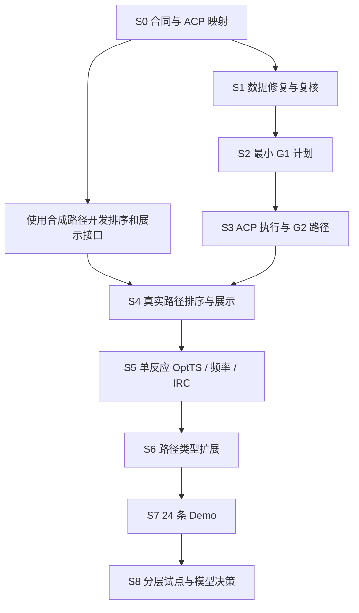

# PES2TS 统一开发顺序与阶段验收

> 状态：历史（已并入主干 G0–G3）
> 层级：主干 G0–G3（原 S0–S8 阶梯）
> 取代关系：阶段表与 demo 里程碑已被 [PES2TS_阶段定义_G0-G3](PES2TS_阶段定义_G0-G3.md) 与 [PES2TS_整体开发与发布方案_v2](PES2TS_整体开发与发布方案_v2.md) 取代；S7 "24 Demo" 降级为 **G2.T 小批测试**，S5 物理验证降为每批验收门。
> 保留原因：S0–S8 的实现检查点与 ACP 固定约束仍有参考价值（映射见阶段定义 §5）。

日期：2026-09-29。状态：开发计划，未代表各阶段已实现。

本文统一后续实施顺序；项目职责沿用《PES2TS_双项目开发与Demo方案》，数据字段与 ACP 映射沿用《PES2TS_数据规范与ACP对接优化方案》。G1 化学计划细节沿用《G1_v2_补全实施总方案》。后续按本文阶段编号跟踪进度。

## 一、总顺序

**共同合同 → 数据隔离与样本复核 → 最小 G1 计划 → ACP 执行适配与 G2 最小路径 → 独立 ranking 与基础展示 → 单反应物理验证 → 复杂路径扩展 → 24 条冻结 Demo → 分层试点与模型决策。**

先完成一条简单反应的端到端闭环，再扩充路径类型。ranking 的接口开发从合成 PathBundle 开始，不必等复杂反应路径全部实现。

## 二、分阶段开发及验收

| 阶段 | PES2TS 交付 | ACP 对接交付 | 进入下一阶段的条件 |
| --- | --- | --- | --- |
| S0 共同数据合同 | 七类对象的 schema、单位/ID/状态字典、版本与引用规则、合成示例和验证器 | 七类对象与任务/产品/展示帧的字段映射表；本地源码版本记录与能力清单 | 合成包可读写和往返转换；原子/帧身份不丢失；非法数值、越界引用和混合能量被识别 |
| S1 数据隔离与样本复核 | 修复 G1 导出及验证器；建立 ReactionCase；复核并冻结 24 条候选；发布迁移清单 | 明确计算侧与评估侧文件及读取权限；反应、实验与 ACP 项目关联 | split 与反应数对账；旧数据保留；真值字段不进入生产输入；映射与筛选来源可审计 |
| S2 最小 G1 计划 | A/B 类单键、H 转移 ScanPlan；显式方向、装配、索引、点列、方法、预算和有限回退 | 将计划转换为 ACP 可接受请求，进行能力和参数静态检查 | map→计算索引与 XYZ 一致；总电荷/多重度明确；计划冻结；超能力请求在提交前被拒绝 |
| S3 ACP 执行适配与 G2 最小路径 | 执行回收、逐帧解析、质量判定、PathBundle 与 ExecutionRecord；一条真实 A/B 路径 | 现有计算入口、任务绑定、WORK/RESULT 布局、产品登记、远程目录与几何获取 | 本地实际跑通；远程适配通过测试且在批量远程运行前完成真实冒烟验证；失败/重试有记录，摘要和几何引用可校验 |
| S4 独立 ranking 与基础展示 | 可用性/拒绝、最高能帧/内部峰/键进度规则、Top-1/Top-3、SeedProposal | TrajectoryFrame/Annotation 投影及 ACP `pes_profile_v2`；能量—结构联动；选点依据与拒绝原因展示 | 只凭冻结 PathBundle 可运行；切换规则无需重算路径；图中帧与候选 XYZ 哈希一致；profile 被 ACP 原生 builder 接受 |
| S5 单反应物理验证闭环 | 验证协议、ValidationResult、阶段失败原因和全成本账本 | 候选交付 OptTS、频率、独立 IRC；结果收集和评估视图；同帧验证去重 | 成功/失败均可回放；只有目标一阶鞍点且双向 IRC 匹配才记通过；重复消费不重复计费 |
| S6 generation 扩展 | C 取代、D/E 多键协同、F/G 特殊事件、H 与不适用反应的 PATH/NEB 或拒绝；统一输出 PathBundle | 扩展方法能力检查与必要计算适配；NEB 投影和几何解析单独验收 | 各机制有有效实例或明确可复现阻断；失败回退符合冻结计划，排序接口保持一致 |
| S7 24 条冻结 Demo | 冻结候选树、规则、预算及验证协议；全量漏斗、方法对照、逐例报告 | 批量任务组织、汇总索引、成本/状态面板、远程恢复与产物定位 | 16 train 调试后锁定，8 valid 同预算检查；拒绝/失败计入完整分母；所有尝试可追溯 |
| S8 分层试点与模型决策 | 200–1000 条试点、反应级去重、冻结验证/测试；估计路径覆盖和排序改进空间 | 分页索引、汇总缓存、资源预算与批量恢复完善 | 有稳定选点改进空间才训练轻量模型；独立测试与同预算 QC 验证后再扩大规模 |

S1 的 24 条化学复核应在读取路径/TS 结果前完成。当前双人独立复核工作簿为 `outputs/01a0ed78-73eb-7833-b3c1-4a6c0733a397/Demo24_双人化学复核.xlsx`，包含两份独立评审表、分歧裁定、候选摘要、映射 SMILES 和填写说明；空白字段不得视作通过。复核决定仍需回写并审计到标准 ReviewRecord/ReactionCase。S7 冻结的是经过 train 调试后的方法和评估设置，不得依据 valid 的计算结果更换反应。

S0 的假数据验证只证明接口可用；S3–S5 才验证真实计算链。S5 出现化学失败时可以验收失败记录和控制流程，但进入规模扩展前应在预先确定的 train 简单样本中获得至少一个严格验证成功实例，并保留此前全部失败，避免只展示成功反应。

## 三、S0 必须先定下来的数据规则

七类核心对象：ExperimentManifest、ReactionCase、ScanPlan、ExecutionRecord、PathBundle、SeedProposal、ValidationResult。另定义 ArtifactRef、MethodSpec、ReviewRecord。

1. **身份与版本**：reaction_id 与 case_id、plan_id、attempt_id、path_id、frame_id 分开；ACP job/task ID 作为外部绑定。重新计算和修改计划生成新版本。
2. **原子和帧**：显式 atom_map_ids 与从 0 开始的 atom_index/frame_index；展示编号独立；原始 R/P 与执行方向分别记录。
3. **结构与能量**：JSON 元数据 + XYZ 几何；原始能量 Hartree，长度 angstrom；分离扫描与精化能量通道；相对能标明参考帧。
4. **状态**：执行状态、路径质量、排序决策、验证结果、产物可获取性独立记录。
5. **来源与成本**：输入/输出摘要、代码/参数版本、实际方法、日志、尝试及成本可追溯；未知值显式 null。
6. **隔离与移植**：生产输入字段白名单；评估区隔离；文件引用可跨机器解析，不依赖绝对磁盘路径。

## 四、ACP 对接的固定约束

- 任务物理目录由 ACP 布局接口分配，科学 ID 保存在元数据；运行数据写入配置的 run_root。
- 原始计算进入 WORK；可消费结果进入 RESULT；通过 version=2 的 result_manifest.json 注册。Product.path 相对 RESULT，科学包相对引用由适配器转换。
- 一次计划候选执行对应可独立重试任务；每个帧作为产物。PES generation 与 PES ranking 可按两个 ACP 项目组织，共用 experiment_id 和 reaction_id；这本身不等于已新增两个 ACP 原生工作流。
- 优先复用已有扫描、BatchOptimize 和 IRC 入口。S0–S2 核对实际接收格式；无法表达的能力显式列为 ACP 扩展项，不静默丢参数。新工作流若确有必要，须补齐 catalog、CLI、编辑覆盖、远程依赖和测试后才能进入 S3。
- 计算扩展沿用 ACP calculations 的基元/执行器分层；PES2TS G1 负责化学计划，G2 按冻结计划执行和质检。
- 排序器仅依赖 PES2TS contracts；不直接读取 ACP 数据库、原始内部目录或生成器私有状态。ACP 排序算法如作基线应显式适配、记录版本。
- 路径图经 TrajectoryFrame/Annotation 投影；远程读取使用统一结果根和缓存。产品 kind 登记不等于解析器和页面已经支持。
- PESsearch 自动建议保留为报告，人工确认走既有专用复核。查看器保存候选，任务创建走统一入口；自动评估通过明确的适配流程，并记录算法选择来源。
- NEB 当前需要补齐投影与几何解析；S6 单独验收，不能仅填写 view_type 即认为可用。
- 发布科学包后由统一写入者更新结果清单；已发布版本不可覆盖。ACP 原地重算前必须归档旧包与执行证据，优先使用新任务。

## 五、依赖关系与可交叉推进的工作

S0 后可交叉推进 ranking 接口、展示投影和验证结果解析，使用明确标识的合成数据。真实数据的联合验收仍按 S3→S4→S5 顺序进行。任何分支都不能把参考 TS/IRC 作为生成或推理输入。

## 六、三个近期里程碑

### M1：标准数据包成立（S0–S2）

交付 schema、正反例、ACP 映射、迁移工具、冻结样本与首个可执行计划。验收重点是格式、化学身份、数据隔离和能力匹配。

### M2：单反应完整闭环（S3–S5）

从复核 R/P 出发，经 ACP 得到路径，独立排序选帧，完成 OptTS/频率/IRC 并记录结果；ACP 能展示结构、曲线、候选、阶段结论与成本。

### M3：24 条可复核 Demo（S6–S7）

按既定分层完成执行和拒绝账本；valid 8 条使用锁定规则、同一 Top-k 和验证预算。分别报告 generation 覆盖、ranking 在相同路径上的表现、端到端正确 TS 比例及全部尝试的成本。24 条仅用于工程验证和逐例诊断。

## 七、当前建议立即开展的工作包

第一工作包限定为 **S0：contracts v1 与 ACP 字段映射**，包含：

- 七类对象及附属对象的最小可执行 schema、字段字典和版本约定。
- 一套端到端合成示例，覆盖有效路径、部分失败、缺失能量、反向扫描及拒绝。
- 从 ReactionCase/ScanPlan 到 ACP 请求，以及 ACP 结果到 PathBundle 的映射说明。
- ACP 产品注册、TrajectoryFrame 投影、候选来源和验证结果的映射说明。
- 合同校验、原子/帧往返一致性、能量可比性和真值隔离测试。

S0 验收通过后进入 S1 的数据迁移与 S2 的真实计划生成。学习模型、大规模计算和全面界面扩展安排在后续阶段。

## 八、第一版实现检查点（2026-09-29）

| 阶段 | 当前仓库状态 |
| --- | --- |
| S0 | 已实现七类严格 v1 合同、规范化摘要、正反/合成示例、真值字段/非法数值/引用检查和 ACP 静态映射；ACP 请求已通过本机 `PesScanRequest` 校验。 |
| S1 | 独立合同版导出树已从旧版完整迁移 183,460 份，迁移清单记录源/目标摘要及 reaction ID 摘要；`endpoint_match` 与 `orientation` 各清除 183,460 次，源目录保留。24 条候选已对账官方 split 为 16 train/8 valid，并生成标准 `ReactionCase` 包；端点多重度现由清理导出中的组分电荷/自旋记录保守解析，24 条 R/P 两侧均可唯一确定；来源记录在 `source.spin_provenance` 与 `demo24_spin_source_audit_v1.json`。24 条仍全为 `needs_review`，因为这不替代独立化学复核。已提供双人复核表与导入器，当前 reviewer/adjudicator 字段为空，故人工化学复核未完成、样本尚未冻结。 |
| S2 | 单键/H 转移计划生成器含复杂成断键与 H₂ 的显式拒绝；拒绝可保存为可追踪 `ScanPlan`，计划保留所有非驱动编辑为观察量。`RXN_0000007104` 的 9 点 ACP 请求、`pes_scan` method levels 和 V1 job-create body 均已生成；另有 `pes2ts acp-request` 可导出请求并选择 ACP checkout 的原生 schema/protocol 预检。合成请求已通过 `V1JobCreateRequest`、`BondLengthScanJobInput`、`PesScanRequest` 和 `validate_scan_protocol`，不触发提交。代码审查发现并修复扫描后端曾固定为 ORCA、与默认 GFN2-xTB 不匹配的问题；现在后端从冻结方法引擎映射，ACP 仅支持的 ORCA/xTB 被接受，未知引擎拒绝。显式记录 C=N 键级变化及 N–H 观察量。ReactionCase 必须为 ready 且 R/P 多重度明确才可计划；计划 ID 覆盖完整候选配置，ACP 预检验证原子映射/摘要。当前预检是自包含冻结快照；人工复核后必须从新批准案例重新生成，尚未提交任务。 |
| S3 | ACP 执行与结果投影有纯适配层：ExecutionRecord 按 candidate/request/task 绑定，逐尝试保留状态、失败码和 CPU 秒数；总成本校验与缺失标志显式区分。PathBundle 保留实际 candidate_id，按所选候选的方法登记扫描能量，且拒绝未就绪计划；帧几何走注入式解析器。新增技术路径质量判定：只有完整覆盖冻结扫描点、目标坐标对齐、所有帧收敛且扫描能量同方法/单位时才标 `usable`；状态经独立评估后写回 PathBundle，明确不等同物理验证。只读 RESULT 清单校验核对路径、SHA256 和大小。新增 ACP `/s2/profile` 与 `/s2/frame/{index}` 响应到 PathBundle 的适配，验证 task/frame/geometry 对齐，缺失单点能量保留为空并默认路径需复核。当前本机没有可见 ACP Workbench/任务进程或 ORCA/xTB；24 条端点化学复核也未完成，尚无实际提交、运行或远程结果回收。 |
| S4 | 有最高扫描能与内部峰两个规则 ranker；排序接受状态由 PathBundle 可用状态门控，建议回显源状态。SeedProposal 绑定来源 PathBundle 内容摘要。新增离线 PathBundle 查看器，支持规则切换、缺失能量断点、曲线选帧与同 ID 结构联动，见 `examples/contracts_v1/path_viewer.html`。合成包分别保存最高扫描能和内部峰建议；新增 ACP 原生图投影和 `pes_profile_v2` 转换；两种建议合并后被 ACP `build_pes_energy_graph` 生成 6 节点/6 标注，并通过 `EnergyGraphResponse` 模型验证。Workbench 活跃任务路由展示、RESULT 几何物化/远程缓存仍待运行时验收。 |
| S5 | 新增 `build_validation_result` 阶段结果聚合器：从 OptTS、频率和双向 IRC 状态推导 `not_run`/`incomplete`/`failed`/`passed`；通过需校验源 proposal 帧、各阶段 ACP task ID、一级鞍点、单虚频和两 IRC 到达不同 R/P 端点。失败尝试与 CPU 成本放入 `pes2ts.validation_costs.v1` 扩展，未知成本保持 null。尚未对接 ACP 的真实 OptTS/频率/IRC 任务、结构/振型/IRC 几何校验和原始产物回放。 |
| S6 | 一维策略对额外成断键、多重 H 转移及 H₂ 机制可生成带拒绝原因的 `ScanPlan`；尚无已复核的复杂路径实例，PATH/NEB 回退未接入。 |
| S7–S8 | 新增 ReactionCase 粒度的 metrics 聚合器与 DemoRunBundle CLI，可分开报告 generation、valid ranking（Recall@1/3、MRR）、端到端验证状态及 CPU 成本/失败原因；未设目标阈值，缺标签时 ranking 明确为 `not_measured`。未执行冻结 24 条真实 demo，也未开展 200–1000 条规模试点。 |

当前全量回归 **449 passed, 3 deselected**；仅默认排除的 `realdata` 标记用例未运行。为不改动全局 Python 环境，将 requirements 固定的 `drfp==0.3.7` 安装到项目忽略的 `.pytest-tmp/deps` 后运行完整测试。清单回归覆盖 SHA256/大小、缺失文件、绝对路径、路径穿越及重复引用；路径质量覆盖完整/缺帧/失败/执行中/不收敛/坐标缺失或错位；验证结果覆盖逐阶段状态、成本缺项、失败重试、源帧一致性及 IRC 正负号互换；Demo 指标覆盖反应级分母、拒绝与缺失运行、独立 ranking 标签、Recall@k/MRR、失败码、成本未知值、过期建议拒绝及 bundle/CLI；spin provenance 覆盖来源组分、原子数/电荷一致性、端点多重度与来源解析结论一致性、SHA256 格式和非单重态耦合歧义；ACP TrajectoryFrame 投影覆盖 ACP 原生类调用、帧/能量/几何和建议摘要绑定、旧建议及结构错配拒绝，ACP `pes_profile_v2` 导出、能量字段分离、缺失能量和安全 geometry 引用，并验证合成 profile 可由 ACP `build_pes_energy_graph` 转换且通过 `EnergyGraphResponse` 校验；ACP 请求 CLI 新增预检导出回归，并使用真实 checkout 校验 job、输入和 PES scan protocol；ACP S2 profile/逐帧几何响应映射覆盖 job ID、连续帧、几何索引和缺失精化能量。修复 Windows `--data-root` 绝对路径重映射，以及原子写入遇到“父路径是普通文件”时的异常类型；这两个回归测试通过。新增 `pytest.ini:testpaths=tests`，避免默认发现递归进入 outputs 下的 node_modules Junction。

### 8.1 Demo24 端点自动审计（2026-09-30）

新增 `scripts/audit_demo24_endpoints.py`、对应 JSON 结果 `data/manifests/demo24_endpoint_audit_v1.json` 和可复核 Notebook `notebooks/demo24_endpoint_audit_v1.ipynb`。审计只读取候选清单、复核队列、官方 split 文件的 reaction_id 首列及已清理 R/P 端点导出；不读取 TS/IRC 几何、能量、标签或势垒。24 条均通过 split、原子映射、端点几何、映射 SMILES 图编辑、组分、电荷/自由基、氢事件计数、导出白名单和复核队列一致性检查；官方 split 为 16 train/8 valid，问题行数为 0。`RXN_0000079731` 的 `resolved_symmetry_collapsed` 映射状态保留供人工查看。24 条化学复核仍为 pending，所以该结果不等于候选化学接受或冻结。

Notebook 三个代码格已按顺序在项目 Python 解释器中执行并保存文本输出；本机 Jupyter 内核启动因 Windows 对连接文件 `SetFileSecurity` 返回 Access Denied 未成功，故本次未做 Notebook 前端渲染检查。随后已将测试依赖 `drfp==0.3.7` 安装到项目忽略目录；当前完整测试为 449 passed、3 realdata 项 deselected。

### 8.2 Demo24 来源多重度审计（2026-09-30）

新增 `pes2ts_core/g1/reaction_case.py:resolve_endpoint_multiplicity` 与 `scripts/audit_demo24_spin_sources.py`。解析器只读取清理 G1 导出中的端点组分和 atom-row 对应关系：至多一个非单重态组分时，总自旋由该组分与任意单重态组分唯一确定；两个及以上非单重态组分保留为 unresolved；从不使用 `multiplicity_max` 推断整体自旋。它核对组分原子数和组分电荷和。

对账 24 条后，R 与 P 端点分别 24/24 可从来源组分唯一解析；生成 `data/manifests/demo24_spin_source_audit_v1.json`，并将 component IDs、各组件多重度和解析理由写入 ReactionCase 的 `source.spin_provenance`。更新后的案例仍全为 `needs_review`，只移除了已由来源数据确定的自旋未知项；独立的反应/映射人工复核未完成。首个 `RXN_0000007104` 计划两侧均为单组分 multiplicity 1，来源审计予以确认，但 ACP 任务仍未提交。

S2 附加校验：计划 ID 现由反应身份、策略版本及完整候选配置共同确定，覆盖方向、观察坐标、点列、方法、预算、回退与重试字段，避免执行策略变化却复用旧计划 ID；首个 ACP 预检 JSON 已按新 ID 重生成。ACP 预检同时校验合同摘要、ReactionCase/ScanPlan 身份、原子顺序、源摘要及 map→零基 index 映射；拒绝计划不能投影成可执行请求。新增回归断言验证身份与映射错配被拒绝。

S5 附加实现：`ValidationResult.status=passed` 要求收敛的一级鞍点、对应的 proposal 初猜帧、恰好一个虚频和双向 IRC 分别到达 R/P（IRC 正负号可互换）。`build_validation_result` 会从阶段证据推导状态，并汇总带失败码的 attempt 与 CPU 秒数；未知成本显式 null。还未运行真实 OptTS/频率/IRC。SeedProposal 现在绑定 `path_content_sha256`，物理验证拒绝源 PathBundle 摘要或选中帧几何不匹配的旧 proposal。

S0/S2/S4 离线演示复核：`python bin/pes2ts demo --output data/interim/pes2ts_synthetic_demo_v1` 已生成 9 份可由合同加载器回读的 JSON（七类对象、拒绝计划及两种规则建议）及 HTML 路径查看器；另以真实 ACP frame 契约生成 `acp_trajectory_graph.json` 和 ACP 原生 `PESsearch` builder 可消费的 `pes_profile_v2.json`。合成 ready case/plan 另生成 `acp_job_request.json`，实际通过 ACP V1 job、bond scan input 和 PES scan protocol 校验，未提交任务。ACP builder 实际生成 6 节点/6 标注，且响应模型校验通过。查看器内嵌 JavaScript 语法校验通过。所有产物均为合成演示，不代表真实计算结果；Workbench 活跃任务路由、真实 RESULT 清单和几何缓存仍待运行时验收。

S1 附加交付：`scripts/build_demo24_reaction_cases.py` 按端点白名单生成 24 份标准合同，存于 `data/interim/g1_v2/reaction_cases_review_v1`，清单为 `data/manifests/demo24_reaction_case_manifest_v1.json`。所有对象均通过生产输入合同校验；端点多重度由可信清理导出中的组分多重度解析并保存来源，全部案例仍为 `needs_review`，计划构造器继续拒绝未完成人工复核的案例。该步骤不读取任何 TS/IRC 产物。

S1 复核闭环：`pes2ts_core/g1/review_import.py` 与 `scripts/import_demo24_review_workbook.py` 可解析 XLSX 固定值，核对两份独立评审、裁定表及 ReactionCase 清单；公式、缺失行、分歧未裁定、重复复核者、错误 case/split、非显式多重度和非 1D 的 M1 接受都会拒绝。成功时生成附属 `ReviewRecord` 与新的不可覆盖案例快照。已用当前空白工作簿实测：24 行被正确读取后因复核者字段为空而拒绝，未写任何输出。当前模板 24 行均为 pending；尚无人工决定可导入。
