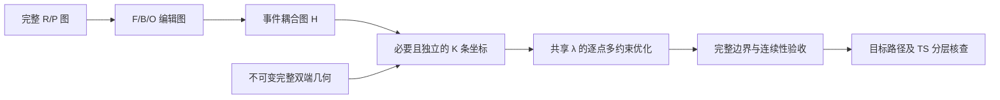

# PES2TS 多键同步一维扫描全面问题报告

日期：2026-10-01。范围：Demo24 的多键编辑图、事件耦合图、当前规划和 ACP 提交实现，以及已完成的 24 个正式任务、394 帧实际结构。本次只做审查和报告，没有修改扫描算法、提交新计算或覆盖既有结果。

> 路径注记（2026-10-03）：本文引用的旧模块路径已随 G-R 布局迁移：`pes2ts_core/scan_strategy/` → `pes2ts_core/generation/planning/`，`pes2ts_core/g2/` → `pes2ts_core/generation/execution/xtb_path/`（`endpoints` → `pes2ts_core/generation/assembly/`），`ranking.py` → `pes2ts_core/ranking/`；正文历史引用保留，不改写。

## 1. 总体判断与责任说明

当前首批计算没有实现用户要求的“多个扫描参数同步沿一个进度变量变化，并保证扫描终点与已知末端一致”。它实现的是“每反应挑选一条已成键的锚点，单独延长该键，优化其他自由度”。这是扫描定义和边界条件的偏差，不能用 24 个任务全部结束、394 帧收敛或测试通过来消解。

我在上一轮实施中把“每个反应仅一份主计划、最终 24 条路径”错误地转换成“每份计划仅一个驱动键”，又把“范围覆盖 TS 主键距离”当成足够的规划前检查。这样丢弃了已经存在的多坐标候选，没有把整体末端一致性接入执行验收。这是实施上的错误。

原始设计也存在与最新要求不同的假设：最多 3 个驱动、允许未驱动事件作为监测、部分复杂反应优先转入其他路径方法、末端按目标等价类验收。这些旧假设必须按用户现在明确的多参数一维与固定已知末端要求重新审定，不能继续支配执行入口。

已完成批次仍可作为单键扫描对照和后端运行证据保存。它未通过本任务所要求的固定端点及完整目标路径验收，不应称为 24 条合格目标反应 PES，也不能据此报告 TS 成功率。

## 2. 正确的任务定义

这里至少有五个独立数量，必须分别记录：

| 概念 | 本任务要求 |
|---|---|
| 反应数 | 24 |
| 每反应主计划数 | 1 |
| 每计划扫描参数维数 | 1，共享 λ |
| 每点驱动/约束数量 | 由多键图和几何需要决定，可以是多个 |
| 重试次数 | 工程执行历史，不能和驱动数、主计划数混为一谈 |

最直接的同步基线是：

```text
λ_i = i/(N−1),  i = 0,…,N−1
q_j(λ_i) = (1−λ_i) q_j(X_start) + λ_i q_j(X_target),  j = 1,…,K
```

每个 λ_i 对应一个同时满足 K 条坐标约束的结构和能量。断键可以变长，成键可以变短，角度/二面角可以按目标变化；它们同时推进时仍是一条一维曲线。不能把每条坐标单独循环形成 N^K 网格，也不能删掉其余坐标来凑“一维”。

用户的末端要求还包含整分子边界：

```text
X(0) = X_start
X(1) = X_target
```

固定边界首先应保留所选已知几何本身，原子身份和参考坐标哈希一致。展示或比较可以消除整体刚体平移/旋转，但不能借此允许内部构象、手性、反应键或组分相对排列发生改变。

仅满足若干 q_j(1) 的数值并不能证明 X(1)=X_target：K 通常小于分子内部自由度数，同一组键长可能对应多个构象或反应分支。因此，多键同步和完整端点固定是两条都要实现的要求。

## 3. 本次检查方法与证据

1. 根据冻结的 Demo24 输入重新构建全部 R/P 图、F/B/O 编辑图及事件耦合图 H，核对实际请求保留了哪些驱动。
2. 检查 `primary.py → run_demo24_acp_primary.py → ACP API → ACP ORCA 接口` 的真实运行链，而非只检查设计接口。
3. 复用上次已经完成的全部 394 帧几何核查；其 TS/IRC 数据通过审计读取器访问，原子对应按已验证 atom map，使用禁止镜像的 Kabsch 对齐。
4. 分别比较提交输入、实际首帧、实际末帧、原始 R/P、IRC 分支末端与已知 TS。整体 RMSD、重原子 RMSD、反应中心 RMSD和全部变化键距离同时记录。
5. 核对已部署 ACP 的多坐标接口和执行方式，并查阅 ORCA 6.1 官方 Surface Scans 文档。

几何表中的 0.2/0.3/0.5 Å 是本次明确使用的筛查尺度，不是通用 TS 认证标准。末端“原样固定”应另用坐标/身份哈希及保存精度级误差判据验收，不能使用宽松 RMSD 阈值代替。

## 4. 多键图告诉了我们什么

重新构图得到：

- 24 条反应共 115 个 F/B/O 编辑：71 个成键或断键编辑、44 个键级变化编辑。
- 22/24 条有多个图编辑，21/24 条涉及多条成键或断键变化。
- 9 条有 4–5 个成键/断键编辑，其中 4 条有 5 个。
- 事件耦合图共有 91 个类型化节点：H_TRANSFER 6、H2_EVENT 3、CONNECTIVITY_EXCHANGE 12、RING_REORGANIZATION 40、DELOCALIZED_REGION 28、SHARED_CENTER 2。
- 实际 ACP 请求全部只包含一条 distance 驱动。

91 个事件节点包含交叠描述，不能解释为 91 个独立反应步骤或 91 根独立约束。图编辑数也不等于必须机械添加的约束数：需要基于强事件关系、目标几何和约束 Jacobian 独立性选出足够的驱动集合，并显式证明没有遗漏必要变化。

### 4.1 图层与执行层的断裂

图层已经有完整的成键、断键、键级变化、H 转移、H2、连接交换和环/离域事件。`selector.py` 正常路线会调用编辑图、端点上下文、耦合图和坐标池。

新增 `primary_stretch()` 却直接比较两端的“存在/不存在键”集合，只选一条键，不消费事件耦合图 H，也不消费已经生成的多驱动集合。`select_primary_candidate()` 还显式过滤掉驱动数不是 1 的候选。完整图信息因此没有进入首批执行。

其他编辑被存成 `monitored_edits`。首批 ACP 请求没有将这些编辑转换为同步约束；当前脚本在事后读取结构计算距离，也没有用这些监测结果作为路径成功的阻断条件。可观测的变化和被保证发生的变化是不同的能力。

正式执行需要保留如下完整链条：



## 5. 实际计算已经暴露的结果

| 检查项目 | 实测结果 | 可作出的结论 |
|---|---:|---|
| 正式任务结束 | 24/24 | 后端运行链打通 |
| 帧数、有限能量、报告收敛 | 394/394 | 本批实际返回了完整数值结果 |
| 与所选原始起点整体坐标直接一致的输入 | 23/24 | 另 1 条改变了组分相对摆放 |
| 各独立组分内部输入几何保留 | 24/24 | 不能据此断言整体复合物排列一致 |
| 首帧相对所选原始起点 RMSD ≤0.2 Å | 20/24 | 首帧重新优化后不保证保持输入 |
| 首帧相对对应 IRC 端点 RMSD ≤0.2 Å | 5/24 | 原始输入与 IRC 两端也不能混为同一参考 |
| 计划末端主键距离匹配原始另一端点，误差 ≤0.01 Å | 0/24 | 末端主坐标边界已经不一致 |
| 末帧整体 RMSD ≤0.2 Å | 1/24 | 单独整体 RMSD 会漏掉局部反应键错误 |
| 末帧整体及全部变化键误差同时 ≤0.2 Å | 0/24 | 本批没有满足该目标端点筛查 |
| 至少一帧主键长度距 TS ≤0.1 Å | 24/24 | 主键距离范围覆盖，不代表目标路径覆盖 |
| 至少一帧整体 TS RMSD ≤0.2 Å | 1/24 | 整体接近的案例很少 |
| 同帧整体 TS RMSD 和全部变化键误差均 ≤0.2 Å | 0/24 | 没有通过严格联合几何筛查 |
| 联合条件放宽到 0.3 Å / 0.5 Å | 0/24、2/24 | 放宽后仍远未覆盖全部反应 |
| 仅反应中心 RMSD 和变化键误差均 ≤0.2 Å | 4/24 | 局部接近不能等同完整 TS 接近 |
| 重原子整体 RMSD 和变化键误差均 ≤0.2 Å | 0/24 | 不能将全部偏差归因于对称氢排列 |

全部反应的最小整体 TS RMSD 范围为 0.197–3.021 Å。19 条曲线有内部离散局部峰，但局部峰可能属于竞争路径或跳支；未执行新的 TS 优化、频率及 IRC 验证，峰数不能当作 TS 数。

### 5.1 氢转移：RXN_0000007104

图中有 N1–H11 断裂、N3–H11 形成，以及 N1–C2 键级变化。首批只驱动 N1–H11。

第 4 帧的 N1–H11 距离与已知 TS 相差 0.037 Å，但 N3–H11 相差 1.385 Å，整体 RMSD 为 0.445 Å。它采样到了供体键的长度，没有同时完成受体键所需的变化。这是单驱动不能代表完整事件的直接反例。

### 5.2 多键连接：RXN_0000109608

图中有 4 个成键编辑和 2 个键级变化。实际从 P 侧只拉伸 3–5。最小整体 TS RMSD 为 0.197 Å，但该帧 3–4 的距离与 TS 相差 0.378 Å；最优联合帧的最大反应键误差仍为 0.326 Å。整体平均误差较小仍不足以保证反应中心正确。

### 5.3 首帧改变：RXN_0000079731

输入来自原始 R，实际首帧相对输入端点 RMSD 为 0.654 Å，重原子 RMSD 为 0.394 Å。首帧沿原始键长约束重新优化，已经不等于原始起点。其变化不能简单解释为文件保存精度或整体平移。

### 5.4 组分摆放：RXN_0000155302

为避免组分重叠，当前起点将一个独立组分沿 x 平移 8.413883924 Å。它保留组分内部几何，但改变复合物相对排列，实际首帧相对未装配原端点整体 RMSD 达 3.047 Å。这个数包含摆放差异，不能全部归因于优化失败；但它确实违背了整体端点原样保持的要求。

## 6. 问题清单、位置与影响

### P0-01：把一份主计划误等同于一个驱动坐标

位置：[primary.py:98](E:/Calculations/AI4S_ML_Studys/PES2TS/pes2ts_core/scan_strategy/primary.py:98)、[primary.py:119](E:/Calculations/AI4S_ML_Studys/PES2TS/pes2ts_core/scan_strategy/primary.py:119)。

计划固定输出 SINGLE_1D，多驱动候选被过滤。正确数量应是 24 份计划，而每份计划可带多条同步驱动。继续使用该入口会系统性丢掉多键图的必要信息。

### P0-02：把目标端点替换成通用解离距离

位置：[primary.py:52](E:/Calculations/AI4S_ML_Studys/PES2TS/pes2ts_core/scan_strategy/primary.py:52)。

当前末端使用“起始键长加 1.6/2.0 Å”“共价半径加偏移”及“另一端距离加 0.3 Å”等规则，强制为正向延长。它不是已知末端坐标；形成键所需的负方向变化在该单锚点模式中被排除。真实驱动应逐条从固定 X_start、X_target 测量 q_j 起止值，允许不同符号；越过末端的探索段若另有需要，应另立任务，不改变本任务边界。

### P0-03：强耦合事件只监测，没有被同步驱动或保证

位置：[primary.py:105](E:/Calculations/AI4S_ML_Studys/PES2TS/pes2ts_core/scan_strategy/primary.py:105)、[coordinate_pool.py:986](E:/Calculations/AI4S_ML_Studys/PES2TS/pes2ts_core/scan_strategy/coordinate_pool.py:986)。

坐标池允许未选驱动进入 monitor，并以 edits_monitored 检查可观测性。单靠这一布尔量，无法证明成键、断键和共享反应中心按要求推进。对必要事件应有“直接驱动 / 由哪些约束确定 / 尚未覆盖”的明确证明。缺乏证明不能自动降为 monitor 后进入正式批次。

### P0-04：没有整分子固定边界的执行语义

位置：[run_demo24_acp_primary.py:63](E:/Calculations/AI4S_ML_Studys/PES2TS/scripts/run_demo24_acp_primary.py:63)、[run_demo24_acp_primary.py:87](E:/Calculations/AI4S_ML_Studys/PES2TS/scripts/run_demo24_acp_primary.py:87)。

ACP 请求只带一份起始 XYZ 和扫描坐标范围，没有作为硬边界的目标完整 XYZ。首尾两点也进入约束优化。即使恢复多条键的末端值，仍可能得到另一构象，不能保证与已知末端一致。必须在任务合同、后端执行和结果验收三层保存完整双端几何及固定边界策略。

### P0-05：绕开已有编译、计划冻结和目标质量链

位置：[run_demo24_acp_primary.py:51](E:/Calculations/AI4S_ML_Studys/PES2TS/scripts/run_demo24_acp_primary.py:51)、[run_demo24_acp_primary.py:208](E:/Calculations/AI4S_ML_Studys/PES2TS/scripts/run_demo24_acp_primary.py:208)。

首批从诊断锚点直接调用 primary_stretch，再手工构建 scheduler 请求。没有调用 compile_orca、多坐标适配器、GenerationPlanV2 完整冻结和 assess_target_path。源文件和计划有哈希是有效的可追溯性措施，但不等于完整科学计划合同已经通过。

### P0-06：多坐标数据投影没有接通到当前 ACP 请求合同

位置：[multicoord.py:405](E:/Calculations/AI4S_ML_Studys/PES2TS/pes2ts_core/integration/acp/multicoord.py:405)、[multicoord.py:435](E:/Calculations/AI4S_ML_Studys/PES2TS/pes2ts_core/integration/acp/multicoord.py:435)。

PES2TS 的投影使用 kind=B/A/D、atom_indices、start_value/end_value、values、driver-01 等字段；ACP 当前 ScanCoordinate 使用 distance/angle/dihedral、atoms、start/end、n_points，真实结果中多坐标 ID 为 coordinate_1 等。还需要一层明确的请求和回收转换，不能把内部 payload 当成现成可提交的 ACP API body。

特别是自定义 per-point values：当前 ACP ScanCoordinate 本身只表达线性 start/end/n_points。把 values 数组放进请求而后仅按 start/end 插值，会改变原计划，不能视为支持非线性调度。需要真实接口扩展或具备冻结逐点列表的执行器，并核对计划目标与实际回收。

### P0-07：三种坐标上限被混在一起

| 层 | 当前限制 | 本次证据 |
|---|---|---|
| PES2TS 候选合同/坐标池 | ≤3 驱动 | contracts_v2.py MAX_SCAN_DRIVERS=3，coordinate_pool 限制组合 |
| ACP 同步扫描合同 | ≤4 坐标，点数相同 | ACP calculations/pes/contracts.py MAX_SYNC_COORDINATES=4 |
| ORCA 原生 Scan / Simul_Scan | ≤3 扫描坐标 | 官方手册 |
| ACP 多坐标实际后端路线 | 每个 λ 逐点多约束优化 | ACP calculations/pes/scan.py 和 ORCAInterface._run_synchronous_relaxed_scan |

ORCA 官方区分嵌套网格和 Simul_Scan 同步推进；原生扫描最多 3 条坐标。这是原生 Scan 的限制，不是单参数曲线的数学限制，也不是所有逐点约束优化的统一上限。[ORCA 6.1 Surface Scans](https://www.faccts.de/docs/orca/6.1/manual/contents/structurereactivity/optimizations_scans.html)

当前部署 ACP 在多坐标时走逐点约束优化，不直接调用 PES2TS 编译的原生 Simul_Scan 文本。需要明确选择执行路线及实测限制。对于 4–5 个连接编辑的案例，先分析必要独立约束；如果必需驱动超过接口上限，应扩展/验证该路线或明确失败，不能通过删键满足上限。

### P0-08：端点几何与组分装配缺少唯一参考和不可变规则

原始 R/P、IRC 分支末端、装配后的复合物、扫描方法下再优化的几何是不同对象。当前没有把“已知末端究竟是哪一个对象”封成不可变执行字段。

原始跨组分坐标可能有独立原点、重叠或无物理意义的距离。不能直接插值这样的跨组分距离；也不能在固定端点任务中自动平移组分后继续称其为原端点。需要固定一个明确的完整参考几何；若它有冲突，则前处理失败并保留原因，不能用启发式另造末端。如果采用已核验 IRC 端点作为参考，应作为版本化新边界明确记录，而非静默替换。

### P1-09：“同步 λ”不自动保证经过已知 TS

同步基线可以使用同一 λ 线性推进全部坐标，但真实反应不必处于 q 空间的直线。RXN_0000007104 的已知 TS 在 N1–H11、N3–H11 两条键的端点归一化进度分别为 0.257、0.811；该点不能同时位于两坐标 s_j=λ 的严格直线上。

这个结果不支持回退成单驱动。它说明“同一 λ”与“每条坐标完全相同的归一化函数”需要区别。先恢复用户要求的同步基线与固定末端；若还要求所有扫描接近已知 TS，则要使用开发核查评估距离，必要时在同一 λ 上采用端点保持的非线性 q_j(λ)，而非增加独立扫描维度。TS/IRC 引导版本必须明确标记为开发/参考引导，不能混入盲测。

### P1-10：多键约束的几何可行性与连续性没有作为实跑门槛

把所有编辑盲目加成硬约束同样会出问题：冗余坐标、环闭合、三角不等式、共线角度、二面角周期及过多冻结自由度都可能使局部优化不适定。需要检查每个 λ 的目标集合，而不仅是两端。

同一组约束可有多个分支。当前以前帧作为下一帧初猜的单端推进没有保证最终落入目标分支。应核对相邻帧结构变化、手性、旁路成断键和最后内部帧到固定终点的间隙。若发生跳支或边界无法连续连接，应失败或在同一主计划内按记录的规则修复，不能靠插入目标 XYZ 制造成功。

### P1-11：验收只覆盖数值返回与一条主键残差

当前 validate_results 检查任务完成、帧数、有限能量、元素顺序及一条主键残差，事后记录其他编辑距离和峰。没有把末端几何、全部必要驱动残差、目标事件完成、过程副反应和 TS 结构覆盖作为成功门槛。收敛数量被汇总，但脚本本身没有在每帧 optimization_converged=false 时明确拒绝；本批实际均为 true，不代表该缺口可以忽略。

已有 target_path.py 区分 execution_complete / numerically_usable / target_path_compatible / validated_ts，这是可复用的分层。它当前检查末帧键/区域/立体目标和记录连续性，未持有并对齐完整固定末端 XYZ，不能单靠接回该模块满足新的整结构边界要求。需要增加独立 boundary_preserved 门和真实几何连续性检查。

### P1-12：能力登记、冒烟测试与实际部署不一致

orca_capabilities_v1.json 的默认 ACP 适配器只登记单 B、一个坐标，版本与本机 ORCA 6.1.1 的部署也未统一，probe_receipts 为空。多坐标接口存在和单键批次成功，均不能替代该接口真实执行能力的证据。

现有 ACP smoke 代表系统是单 B；ORCA smoke 文件包含双 B、A/D、自定义逐点等场景，但完整默认测试中这些 gated 测试被 deselect。当前没有本批实际使用的 ACP 多键固定双端链条的成功回执。必须新增/运行与所选执行路线对应的真实小体系检查，并独立验证末端保持。

### P1-13：界面及结果标识仍围绕单 coordinate

ACP 已支持 coordinates 列表、多驱动逐帧目标与实际值，但原请求只提交 coordinate。回收转换还要统一 driver-01 与 coordinate_1 身份，避免只显示第一根键或遗漏另一个角度。曲线横轴应可明确表示共享 λ，结构节点同时展示所有约束的 target/actual/residual；不能用一个主距离的误差掩盖其他驱动偏离。

### P1-14：候选、路径、尝试与成功计数混淆

502 是历史候选记录，24 是反应数，394 是结构帧数。它们没有给出目标路径成功数。一次主计划可以有 K 条坐标，也可以在审计内有工程重试。应分别保存 candidate_count、primary_plan_count、driver_count、parameter_dimension、scheduler_attempt_count 和 scientific_acceptance。

当前 manifest 写 max_primary_attempts_per_reaction=1，但 20 条容量等待者经历取消及原任务重算，试算另有失败/重算和一次重复提交。需要明确这里“primary attempt”究竟是计划假设次数还是 ACP 调度尝试次数。额外试算已单独保留，不应删除；正式项目 24 条并不等于全程只执行过 24 次任务尝试。

### P1-15：离线测试和“计划全勾选”没有验证用户要求

1360 项完整默认回归及后续 3 项身份去重测试证明了一批代码行为，但 primary_stretch 新测试恰恰只检查“每反应一条有效成键、正向延长”，没有检查多键同期驱动和固定末端。错误需求也可以得到全绿测试。

旧计划的多坐标编译/回收/目标层已标记完成，许多函数也确实存在；但首批运行绕过它们，且真实端点验收失败。因此“实现存在”“模块通过测试”“端到端需求满足”需要分别报告。

### P2-16：工程恢复有效，但不是科学修复

首个失败涉及 xTB 线程过量；提交脚本曾把数值 2000 当 MB，而 ACP 将裸数字解释为 GB。已修复明确内存单位和 ORCA helper 线程数。批量等待又遇到 ACP STARTING 资源计数互相阻塞，已用原任务重新排队和并发限制恢复；任务名称重写导致去重漏掉试算，已改为科学身份去重。

这些工程修复解释了如何得到 394 帧，不能解释为多键机制或末端约束已经修复。现有结果必须保留两类问题的独立历史。

## 7. 原代码哪些可以复用，哪些需要替换或接通

| 模块 | 现状 | 后续处理 |
|---|---|---|
| endpoint_graph / reaction_edit_graph / event_coupling | 完整图和类型化耦合可重建 | 继续使用，并成为执行坐标选择的唯一可追溯输入 |
| coordinate_pool / schedules | 有多驱动和共享 λ，存在 ≤3 上限及 monitor 覆盖假设 | 校正必要事件覆盖和执行路线相关限制 |
| compile_orca | 所有驱动都编译，起止值来自两端几何，支持同步/逐点配方 | 保留其完整坐标语义；补足整几何固定边界合同 |
| multicoord | 构建内部请求、回收全驱动，不负责提交 | 接到实际 ACP API 字段和坐标 ID，核对自定义列表是否真实执行 |
| ACP ReactionCoordinatePlan / ORCA 多坐标路线 | 共享进度，逐点施加多约束 | 具备实现基线的代码基础；仍须实测多键与固定双端 |
| primary.py 单键推广 | 强制只一条已成键正向拉伸 | 退出正式执行入口；如保留只能明确作为单键对照 |
| run_demo24_acp_primary.py | 手工单 coordinate 请求，数值验收 | 不再作为正式多键批次入口；保留首批可复现历史 |
| target_path / frame_recovery | 有全驱动与目标质量分层 | 接入正式链，并扩展完整末端和几何连续性验收 |
| 实跑和事后几何报告 | 已有可追溯数值证据 | 保留为失败基线，不能重标为合格目标路径 |

本次没有证明这些模块联接之后一定通过全部 24 条。报告所确认的是已有可复用能力、明确的接口缺口及必要验收条件。

## 8. 固定端点的实现要求

1. 每份计划保存不可变的 start_geometry、target_geometry、atom_map_order、charge/multiplicity、参考来源和哈希，明确显示方向；反向执行时展示可重新按 R→P 排列。
2. 原始 R/P 和 IRC 末端不一致时，不能混用其坐标定义。默认忠实保持被选定的已知完整末端；参考改变必须生成新版本。
3. 第 0 帧及最后一帧保留固定几何，按同一计算方法做单点能量；内点进行多约束优化。若端点是原始结构而非该方法下驻点，这个事实单独记录，不允许在端点优化后覆盖原几何。
4. 固定双端不是“先跑完单端扫描，再把目标 XYZ 放在最后”。执行策略应逐步向固定边界连续连接；必要时对接近边界的自由度增加明确的形状控制，或者采用保持共享 λ 的双端初始化/受约束路径修复。
5. 最后内部点到固定末端若有过大几何或能量跳变，必须失败。仅附加正确末端而内部路径不连贯，仍不合格。
6. 不要求对全部内点锁死所有笛卡尔自由度。内点仍为多参数同步约束下的松弛优化；额外约束仅针对必要的构象、立体、装配与边界连续性，并按 Jacobian 独立性检查。

其中第 3–6 项是建议的执行合同和验收方向，尚未在当前 ACP 正式请求中实现。本次没有把“文件末帧相同”当作连续路径已经被保证。

## 9. 修复顺序与验收矩阵

### 优先顺序

1. 停止把当前单键入口作为目标批次入口，固定 24 份计划、多条驱动、共享一个 λ 的语义。
2. 固定唯一完整双端，检查图/几何身份、组分装配、手性和电子态；有冲突就报告。
3. 从多键图与强事件组件选择必要的独立驱动，逐条给出起止目标、符号、单位、映射及覆盖说明。重新审定 ≤3/≤4 限制。
4. 接通编译和真实 ACP 多坐标请求/结果合同；不支持的列表或坐标数量明确拒绝，禁止降为单驱动。
5. 加入固定双端、逐帧全驱动残差、目标编辑、连续性、末端和 TS 接近度的独立门。
6. 先用小体系和代表性反应验证多键及完整边界，再执行同一 24 条固定批次。新批次单独版本化，保留旧单键对照。

| 验收场景 | 必须检验 | 禁止的假通过方式 |
|---|---|---|
| 数量与维数 | 24 个唯一反应、每反应 1 主计划、parameter_dimension=1、K 可大于 1 | 将 K=1 当作一维验收 |
| 混合成断键 | 同一帧长键变长、成键变短，所有坐标共用 λ_i | 分别跑两条单键曲线 |
| 必要耦合覆盖 | 每个必要事件有直接/确定性约束证据 | 只有 monitor 名称 |
| 4–5 连接编辑 | 独立坐标分析、能力与边界审查 | 为满足上限丢弃必要键 |
| 请求编译 | ALL drivers、同 N、单位正确、map→index 正确 | 只保留 coordinates[0] |
| 自定义调度 | 实际 target 与冻结 values 每项一致 | ACP 忽略 values 后按 start/end 线性重算 |
| 固定完整双端 | 首尾身份/坐标哈希与保存精度级误差 | 松弛后近似相同或手工替换末帧 |
| 相邻结构连续 | 内点与固定边界连接，无跳支或意外副反应 | 仅索引连续、文件数量完整 |
| 每点数值质量 | 所有驱动残差、收敛、有限几何能量、计算方法一致 | 单主键残差小即成功 |
| 目标反应 | 全部目标编辑、立体、区域和目标边界通过 | 将数值完成当目标完成 |
| TS 几何覆盖 | 同帧整体/反应中心/变化键联合指标；保存最接近帧 | 距离范围涵盖或存在局部峰 |
| 严格 TS | 新 TS 优化、一阶虚频、目标运动及两侧 IRC | 几何相近即声称验证 TS |
| 前端 | λ 曲线、全驱动数据、首尾/路径/TS 状态分开展示 | “completed” 隐含科学合格 |

### 建议的独立结果字段

```text
execution_complete
all_frames_numerically_usable
shared_lambda_verified
all_required_drivers_preserved
boundary_preserved
path_continuous
target_path_compatible
ts_geometry_covered
validated_ts
```

作业可以 execution_complete=true，而 boundary_preserved=false 或 target_path_compatible=false。这样的结果仍须按不合格目标路径报告。

## 10. 结论与交付范围

当前首批计算已经证明 ACP 可以运行单距离 PES，并未证明用户要求的多键同步固定双端扫描。主导问题是错误的计划语义、单驱动执行入口和缺失的完整边界合同；调参、增加点数或扩大单键范围不能解决这些问题。

恢复多键同步、保证已知末端，以及保证接近已知 TS，分别需要驱动集合、完整边界执行和路径形状/科学验收。三者必须保持同一主计划和共享 λ 的定义，不能互相替代。

本次交付为问题报告和可复核图证据，未实施上述修复。下一阶段的正式批次应在这些验收条件通过后再定义“成功”，不继承当前批次的完成标志作为科学成功。

## 附录 A：证据索引

- [原始一维扫描设计](E:/Calculations/AI4S_ML_Studys/PES2TS/docs/design/PES_GENERATION_图论扫描策略选择器设计_v1.md:15)：维数、驱动数、多坐标语义及旧假设。
- [上一轮几何核查](E:/Calculations/AI4S_ML_Studys/PES2TS/docs/reports/PES2TS_Demo24_端点与TS几何核查_20261001.md)。
- [逐帧几何汇总](E:/Calculations/AI4S_ML_Studys/PES2TS/outputs/demo24_acp_geometry_audit_20261001/summary.json)：全部 394 帧指标。
- [多键要求统计](E:/Calculations/AI4S_ML_Studys/PES2TS/outputs/demo24_acp_geometry_audit_20261001/multibond_requirement_audit.json)。
- [重建图统计](E:/Calculations/AI4S_ML_Studys/PES2TS/outputs/demo24_acp_geometry_audit_20261001/graph_requirement_summary.json)及各 RXN_*_graph.json：完整编辑和耦合图。
- [正式批次请求回执](E:/Calculations/AI4S_ML_Studys/PES2TS/outputs/PES2TS_Demo24_primary_20261001/submission_receipt.json)及各 PrimaryPlan.json、ACPJobRequest.json、ACPProfile.json、frames/*.xyz。
- [只读图重建脚本](E:/Calculations/AI4S_ML_Studys/PES2TS/scripts/audit_demo24_graph_requirements.py)、[几何审查脚本](E:/Calculations/AI4S_ML_Studys/PES2TS/scripts/analyze_demo24_acp_geometry.py)。
- ACP 实际代码：`src/acp/calculations/pes/contracts.py`（坐标合同）、`src/acp/calculations/pes/scan.py`（同步计划和逐点分派）、`src/cccp/qc/interfaces/constraints.py`（共享进度）、`src/cccp/qc/interfaces/orca.py`（逐点多约束优化）。本报告根据本机部署代码审查，不以旧能力登记代替。

## 附录 B：24 条逐反应多键与几何结果

F 为成键，B 为断键，O 为键级变化。实际每条只保留表中一根 B 距离驱动；这里的“B 距离”是内部坐标种类，与断键编辑 B 的含义不同。方向为本批实际计算方向。RMSD 均消除整体刚体运动，末端误差按原始另一端点计算。

| 反应 | F/B/O | 连接编辑数 | 实际驱动 map | 方向 | 末帧/原目标 RMSD Å | 最小 TS RMSD Å | 联合 0.2 Å 通过 |
|---|---:|---:|---|---|---:|---:|---|
| RXN_0000007104 | 1/1/1 | 2 | 1–11 | R→P | 1.185 | 0.432 | 否 |
| RXN_0000017762 | 3/1/2 | 4 | 7–8 | P→R | 1.684 | 1.096 | 否 |
| RXN_0000026256 | 0/1/0 | 1 | 3–7 | R→P | 1.517 | 1.264 | 否 |
| RXN_0000047010 | 1/1/5 | 2 | 2–3 | R→P | 1.766 | 1.293 | 否 |
| RXN_0000053132 | 1/1/2 | 2 | 5–6 | P→R | 1.899 | 0.303 | 否 |
| RXN_0000059834 | 3/2/1 | 5 | 1–10 | P→R | 2.297 | 1.067 | 否 |
| RXN_0000074997 | 1/4/3 | 5 | 3–8 | P→R | 1.192 | 1.129 | 否 |
| RXN_0000077619 | 1/0/0 | 1 | 2–5 | P→R | 1.806 | 1.347 | 否 |
| RXN_0000079731 | 0/1/1 | 1 | 6–8 | R→P | 1.498 | 0.778 | 否 |
| RXN_0000091050 | 1/1/0 | 2 | 1–9 | R→P | 1.176 | 0.819 | 否 |
| RXN_0000094438 | 3/1/2 | 4 | 2–7 | P→R | 1.880 | 0.924 | 否 |
| RXN_0000100071 | 2/1/1 | 3 | 3–4 | R→P | 1.405 | 1.030 | 否 |
| RXN_0000100736 | 2/2/1 | 4 | 5–13 | P→R | 1.215 | 0.365 | 否 |
| RXN_0000102998 | 2/1/1 | 3 | 4–8 | P→R | 1.502 | 0.394 | 否 |
| RXN_0000109608 | 4/0/2 | 4 | 3–5 | P→R | 1.988 | 0.197 | 否 |
| RXN_0000110869 | 1/1/6 | 2 | 8–9 | P→R | 1.540 | 1.372 | 否 |
| RXN_0000132222 | 2/1/1 | 3 | 3–16 | R→P | 0.164 | 0.423 | 否 |
| RXN_0000138453 | 1/2/5 | 3 | 2–6 | R→P | 1.043 | 0.421 | 否 |
| RXN_0000149368 | 1/3/2 | 4 | 2–4 | R→P | 1.402 | 0.620 | 否 |
| RXN_0000155302 | 1/1/2 | 2 | 1–5 | R→P | 3.367 | 3.021 | 否 |
| RXN_0000161724 | 1/1/0 | 2 | 5–13 | P→R | 0.818 | 0.330 | 否 |
| RXN_0000171675 | 1/1/2 | 2 | 1–5 | R→P | 1.882 | 1.391 | 否 |
| RXN_0000187964 | 3/2/1 | 5 | 3–7 | R→P | 2.077 | 1.221 | 否 |
| RXN_0000194484 | 4/1/3 | 5 | 2–10 | P→R | 2.312 | 0.758 | 否 |
